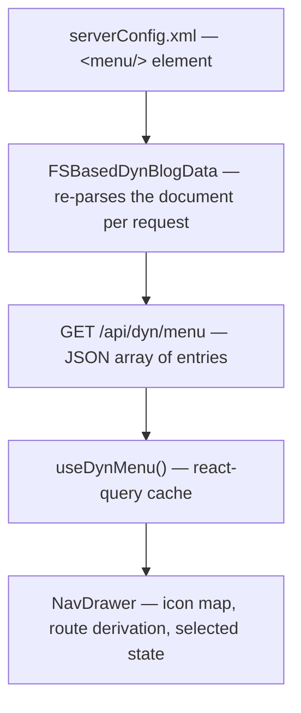

# Drawer Menu — Design Notes

## 1. Why a drawer, and why it is configured rather than coded

The home page is not a good place to place everything in it. It started as a
single-page portfolio — hero, live stream, about, posts, projects, contact —
and that shape breaks down as soon as the site grows a second kind of
content that has no business on the home page (the entertain page's media
shelves being the first). What the site needs at that point is _navigation_,
not a longer home page.

The drawer (`web/site/src/components/NavDrawer.tsx`) is the site's answer:
a hamburger button at the left end of the top bar slides a MUI `Drawer` in
from the left edge, listing every top-level page. A drawer — rather than a
row of tabs in the bar — because the top bar is deliberately thin
(breadcrumb trail on the left, account/language/theme controls on the
right), and a list behind a button scales to any number of entries without
competing with that chrome. It dismisses the MUI way: clicking the backdrop
shade, pressing Escape, or picking an entry.

The entries are **server configuration, not code**. The site's dynamic data
already lives in `serverConfig.xml`'s `<dynBlogData/>` section and is
re-read from disk on every request (see `pkg/models/dyn`); the menu simply
joins that family. Adding a page to the menu is then an edit away — no
frontend rebuild, no server restart — which is exactly the right cost for a
list that changes at deployment pace, not at code pace. It also keeps the
_drawer's_ contents declarative and reviewable in one place, next to the
data the entries point at (the entertain shelves live one element away).

## 2. The data model

The menu is authored as a `<menu/>` element of `<dynBlogData/>`, holding
`<menuEntry/>` children in display order:

```xml
<menu>
  <menuEntry
    id="6ce7ecbd-3ddc-4d58-b2f6-4828a50b7e85"
    name="home"
    displayName="Home"
    iconClassName="home"
  >
    <i18nDisplayName key="en" value="Home" />
    <i18nDisplayName key="zh" value="首页" />
  </menuEntry>
</menu>
```

Each `<menuEntry/>` carries:

| Attribute       | Required | Meaning                                                                                                |
| --------------- | -------- | ------------------------------------------------------------------------------------------------------ |
| `id`            | yes      | Unique entry identifier (a UUID); used as the React list key.                                          |
| `name`          | yes      | The page's route slug — the drawer navigates to `/<name>`; the special name `home` maps to `/`.        |
| `displayName`   | yes      | The entry's caption — the fallback when no `<i18nDisplayName/>` child matches the active language.     |
| `description`   | no       | A secondary line under the caption; omitted when empty.                                                |
| `iconClassName` | yes      | Picks the icon from the frontend's icon map (`"home"`, `"musicNote"`, …); unknown → generic link icon. |

Each optional `<i18nDisplayName/>` child localizes the caption: `key` is an
i18n language code (matched against the frontend's `i18n.language` — `"en"`,
`"zh"`), `value` the caption for that language. The split exists because
captions are presentation text in the visitor's language, while `name` and
`iconClassName` are language-neutral wiring — translations would not belong
in the frontend's locale bundles either, since the entry set itself is
configuration.

The pipeline, end to end:



- **Go side** (`pkg/models/dyn/dyn.go`): `MenuEntry` mirrors the element;
  the `<i18nDisplayName/>` children collapse into
  `I18nDisplayNames map[string]string` (language code → caption), omitted
  from the JSON when empty. `Description` is likewise `omitempty`.
- **API side** (`pkg/api/dyn/dyn.go`): `GET /api/dyn/menu` serves the array
  in document order; a nil provider serves `[]`, so the drawer renders empty
  rather than erroring on a configuration-less server. The endpoint rides
  the existing `/api/dyn/` JWT whitelist prefix — navigation is public data.
- **Frontend** (`useDynBlogData.ts`, `NavDrawer.tsx`): the wire type is
  `DynMenuEntry`; the caption resolves as
  `i18nDisplayNames?.[i18n.language] ?? displayName`, and the icon through a
  `Record<string, ReactNode>` map (`home` → `HomeIcon`, `musicNote` →
  `MusicNoteIcon`) with a `LinkIcon` fallback, so a typo in the config
  degrades the icon, never the page.

## 3. Route derivation and selected state

The entry's `name` _is_ its route — there is no separate `href` attribute.
`home` is special-cased to `/`; every other name navigates to `/<name>`.
That keeps the configuration minimal (one field names both the page and its
address) at the price of a convention: a page's route segment must equal its
entry's `name`. The selected highlight is then a plain string comparison,
`pathname === href`, computed the same way for every entry.

## 4. Layering: why the drawer sits above the top bar

One non-obvious detail: the site's top bar deliberately sits at
`theme.zIndex.modal + 1` so its controls stay reachable over modal dialogs
(the login page's always-open dialog being the case that forced it). A
drawer at MUI's default `zIndex.drawer` would therefore slide _under_ the
bar, and its backdrop shade would stop there too — clicking the shade over
the bar would not dismiss it, and the bar would visually float above the
drawer's top edge. The drawer instead renders at `modal + 2` (the same trick
the profile menu uses), so the shade covers the viewport uniformly and every
pixel of it dismisses on click.
