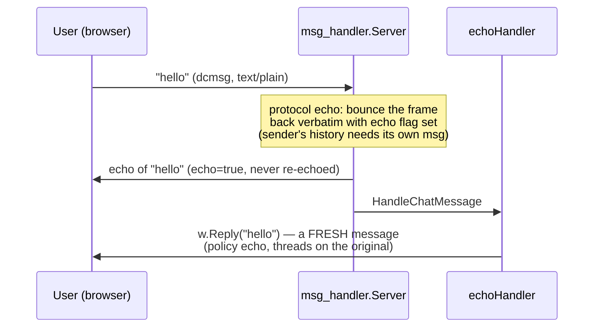
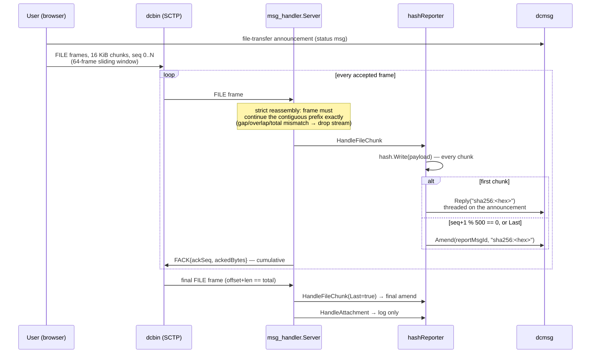

# Echo Bot — Workflow Analysis

## 1. Position in the stack: same three layers, minimal policy

The echo bot (`pkg/rtc/echobot`) sits on the _identical_ three-layer stack we studied for the music bot — `HeadlessRTCClient` → `msg_handler.Server` → `BotMessageHandler` — and was in fact the bot that _forced_ that architecture into existence (session 23 split the original monolithic echo bot into `msg_handler` + policy). Where the music bot is a policy about **media**, the echo bot is a policy about **proof of delivery**: "bounce everything back and prove it arrived." It is the Go counterpart of the browser's `useDataChannel` + `useBinaryDataChannel`, specialized to conformance-testing the protocols against themselves.

The whole policy is ~100 lines across two files:

| `BotMessageHandler` method | Echo bot behavior                                                      |
| -------------------------- | ---------------------------------------------------------------------- |
| `HandleChatMessage`        | `w.Reply(msg.Text)` — reply with identical content                     |
| `HandleFileChunk`          | fold the chunk into a running sha256, report it (throttled)            |
| `HandleAttachment`         | log the finished transfer (size + digest); retain nothing              |
| `HandleCalling`            | decline every INVITE with `603 Decline`; ignore the rest of the dialog |

Unlike the music bot, **the echo bot never touches the media plane at all** — it calls none of `Accept`/`Invite`/`AttachMedia`/`OnTrack`. A call is no use to it, so an INVITE (voice or video alike) is declined on the spot; the dialog's remaining messages (CANCEL, BYE, response folds) are the _caller's_ business, so they're ignored. It is a pure data-channel bot.

## 2. The chat echo — and why it's not the protocol echo

One subtlety worth isolating: there are **two distinct echoes** on a chat line, and the bot's doc comment is careful to attribute them:



- The **protocol echo** (the Server's "classical conditioning") serves the sender's chat history — every accepted message is bounced back with the echo flag so both ends build the same history. Echoed frames are never echoed again.
- The **policy echo** is the bot's actual reply: a _fresh_ message with identical text, threaded on the user's original via the `ResponseWriter`'s `inReplyTo` anchor.

The handler itself is a plain struct with nothing to synchronize — all state lives in the hash feature.

## 3. File transfer: the hash report, end to end

This is the echo bot's showcase feature and the reason `Reply`/`Amend` exist on `ResponseWriter` in that shape. The workflow, from the wire up:



**The transport layer (Server, `binarySession.accept`)** — because SCTP delivery is ordered and reliable, reassembly is _strict prefix continuation_: the first frame must start at seq 0/offset 0, and every subsequent frame must pick up exactly where the last ended, with a consistent `total`. Any deviation marks the stream corrupt and drops the whole transfer. Every accepted frame gets a cumulative `FACK` (`ackSeq` = next expected seq, `ackedBytes` = contiguous byte count), which is what advances the sender's 64-frame (1 MiB) sliding window — the send-side flow control. Files multiplex over one channel, keyed by `file_id`.

**The policy layer (`hashreport.go`)** — the running digest is computed _as the bytes stream through_, never over retained data:

- State is a `sync.Map` keyed by `(peer, fileId)` → `hashReport{hash, reportMsgId}`. The framework guarantee that one transfer's chunks arrive serialized on one goroutine means a report's fields need no lock — only the shared map does. This was an explicit user directive from session 23: _no framework state, no handler locks_ — how a feature keeps state is the implementer's affair (the Telegram-bot-framework shape).
- **First accepted chunk opens the report** with `Reply("sha256:<hex>")` — threaded on the transfer's announcement _when one was seen_ (cross-channel ordering isn't guaranteed; the chunk may arrive before the announcement, in which case it threads on nothing). The msg id is recorded only once the send succeeds, so a failed send retries on the next chunk.
- **Throttle**: amending per 16 KiB chunk is needlessly chatty, so amends fire every `hashReportChunkInterval = 500` accepted chunks — but only when the hash actually moved, and the **final chunk always amends**, so the report provably ends on the file's complete digest. (The hash itself absorbs _every_ chunk; only reporting is throttled. Session 22 records this going from per-chunk → 1/100 → 1/500 at user request.)
- **Completion**: `chunk.Last` deletes the map entry; the subsequent `HandleAttachment` just logs size + digest — the bot retains nothing.
- **Known bounded leak**: a transfer the Server drops mid-stream (corrupt) or that dies with its session leaves its `hashReport` entry behind forever — bounded by the number of aborted transfers, deliberately accepted (a purge would need a framework hook the user declined to add).

**Empty-file edge**: an empty file is one FILE frame with empty payload, so the flow degrades to open-and-final-amend in a single chunk — one report, correct digest of the empty string.

### The bot as protocol test instrument (session 22)

A nice historical datapoint: the echo bot's _instant_ FACKing once exposed a frontend bug. The browser sender's progress emit sat after its window-refill loop — it only fired when the 64-frame window stalled. Human receivers stall it constantly (busy main thread + RTT), but the bot acks every chunk instantly with no UI thread, so the window never filled and progress jumped pending → done. The smoking gun was a single status update reading `119472128 = 7292 × 16384` — a number the pump could only learn from continuously arriving FACKs. The fix was frontend-side; the bot was proven byte-exact against the wire protocol. The echo bot is, structurally, the protocol's conformance peer.

## 4. Call handling: decline-only

```go
func (h *echoHandler) HandleCalling(_ context.Context, sip *msg_handler.SipMessage, w msg_handler.ResponseWriter) {
    if sip.Method != msg_handler.SipMethodInvite {
        return
    }
    // ... log ...
    w.Reject(msg_handler.SipCodeDecline, msg_handler.SipPhraseDecline)
}
```

That's the entire call policy. Notably it predates the media API: when the interface was first cut (session 23), `Accept`/`OnTrack` were shaped on `PeerConnection.AddTrack`/`OnTrack` _by user directive_ but inert (`ErrMediaUnsupported`) — the echo bot never needed them, and they only became real in session 24 when the music bot required them. On the browser side, the 603 folds into the caller's phone-session state as `rejected` (precedence maximum), the ring stops, and the log entry shows declined — no media was ever offered, so no renegotiation ever happens.

## 5. Hosting: a machine client of the server itself

Both bots are hosted by the server binary as **ordinary authenticated clients** (`cmd/server/main.go`):

- Configuration: `<echoBot/>` / `<musicBot/>` elements in `serverConfig.xml` (`BotClientXML`: url, jwt, channelId, subscriberId, iceServers, timing knobs). Present + url + jwt → wired.
- Identity: a **static session JWT** issued offline with the `sign` subcommand (e.g. `--sub bot:echo --username "Echo Bot"`). The bot never inspects the token — the SS endpoint validates it and stamps the token's subject/session onto its events and the username claim as display name. A bad token simply surfaces as logged 401s in the reconnect loop. (Known open item from sessions 18–20: the config-file JWT is never refreshed.)
- `startBotClient` (shared by both bots since session 24) builds the `HeadlessRTCClient`, calls `wire(client)` — `echobot.New` self-registers the `dcmsg`/`dcbin` handlers at construction and "needs no further driving" — then runs the **reconnect loop**: a fresh channel pair per attempt, `transport.Run` (WebSocket, `Authorization: Bearer`) against `client.Run`; when either ends, log and retry after `reconnectInterval` (default 5 s). The loop also absorbs the startup race where the bot's first dial can beat `ListenAndServe`.
- An empty `iceServers` attribute means host candidates only.

## 6. Echo bot vs. music bot — the two policies compared

| Aspect               | Echo bot                                       | Music bot                                                   |
| -------------------- | ---------------------------------------------- | ----------------------------------------------------------- |
| Chat                 | echo verbatim                                  | CLI (`/help`, `/list-songs`, `/play`)                       |
| Attachments          | consume → sha256 report                        | refuse with one chat line                                   |
| Incoming voice call  | decline 603                                    | accept, answer with music                                   |
| Incoming video call  | decline 603                                    | decline 603                                                 |
| Outgoing calls       | never                                          | `/play` phones the user                                     |
| Media plane          | untouched                                      | `TrackLocalStaticSample` + 20 ms pump, PCMU                 |
| Per-peer state       | none (per-transfer map keyed `(peer, fileId)`) | `sync.Map` peer → `peerCall` (phase, player)                |
| Uses `Reply`/`Amend` | both (report + amend)                          | `Reply` only                                                |
| Uses call media API  | none                                           | `Accept`, `Invite`, `AttachMedia`, `DetachMedia`, `OnTrack` |
| Role in the system   | protocol conformance peer                      | media feature demo                                          |

## 7. History

- **`03f0517` "Added RTC bot"** (session 17): the original monolithic echo bot — `HeadlessRTCClient` + dcmsg/dcbin codecs + echo policy in one package; session 18 added the reconnect loop and JWT hosting; session 21 established the test discipline of correlating expected messages by the protocol's own keys (`inReplyTo`, `callId`, `targetMessageId`) rather than positional indexing.
- **Session 22**: the hash-report throttle (1/chunk → 1/500, first + final always) and the FACK-driven progress-bar bug hunt above.
- **Session 23**: the refactor that created `pkg/rtc/msg_handler` — the echo bot shrank to policy + `hashReporter`, and the `BotMessageHandler`/`ResponseWriter` contract was cut (with `Accept`/`OnTrack` deliberately shaped-but-inert).
- **Session 24 / `f562029`**: the music bot reused the split, made the media API real, and unified hosting into `startBotClient`.

### One-line summary

The echo bot is the stack's conformance peer: a stateless chat mirror, a streaming sha256 oracle that reports the running digest of every file _while_ the Server's strict SCTP reassembly acknowledges each 16 KiB frame back to the sender's sliding window, and a universal call decliner — all media-free, all policy, with the entire protocol machinery (echo discipline, reassembly, FACKs) owned by the `msg_handler.Server` layer beneath it.
