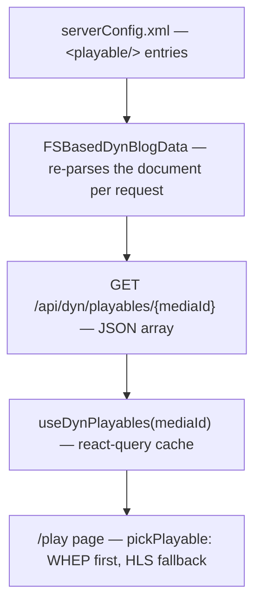

# Media Subsystem — Design Notes

## 1. Why a media subsystem, and why _media_ is not _playable_

The entertain page's shelves (`<live/>`, `<video/>`, `<music/>` card entries)
answer the question "what is there to watch" — a display name, a
description, a thumbnail, a unique **media id**. They deliberately do not
answer "how do I actually play it": one stream is commonly reachable through
several protocols at once (a MediaMTX path serves the same stream over WHEP
and HLS), and which one a viewer should get depends on their browser, not on
the media.

That is the split at the core of the subsystem:

- A **media** is the catalog entry — what the card shows.
- A **playable** is one way to play a media — a protocol-typed URL. Zero or
  more `<playable/>` entries live as children of `<dynBlogData/>`, each
  pointing at its media by `mediaId`:

```xml
<playable id="mystream-whep" mediaId="mystream" type="whep" url="/mystream/whep" />
<playable id="mystream-hls" mediaId="mystream" type="hls" url="/hls/mystream/main.m3u8" />
```

| Attribute | Required | Meaning                                                                                          |
| --------- | -------- | ------------------------------------------------------------------------------------------------ |
| `id`      | yes      | Unique playable identifier.                                                                      |
| `mediaId` | yes      | The media id of the `<live/>`/`<video/>`/`<music/>` entry it plays; several may share one.       |
| `type`    | yes      | The protocol `url` speaks: `"whep"` (WebRTC HTTP Egress) or `"hls"` (HTTP Live Streaming, m3u8). |
| `url`     | yes      | The endpoint to play from — absolute, or site-relative when the stream server is proxied.        |

The split pays for itself twice over. The catalog stops carrying wire
details (a shelf entry needs no URL at all), and adding a protocol variant
to a media is one more element away — no card edit, no migration.

Consequently the media card's `href` attribute is **optional**: with one,
clicking the card navigates there (an external VOD file, a clip page); without
one, the card links to the site's own play page, `/play?mediaId=<id>`, which
resolves the media's playables. A media with neither `href` nor playables is
a valid configuration — its card leads to the play page, which reports the
media as unplayable.

## 2. The getPlayableByMediaId API

`DynamicBlogDataHandler` (`pkg/api/dyn`) serves the playables of one media:

```
GET /api/dyn/playables/{mediaId}   →   JSON array of playables, document order
```

Two deliberate shape choices:

- **An array, not a single object.** The whole point of the playable entity
  is that a media may offer several protocol variants; the chooser belongs
  to the client, which alone knows what its browser can play.
- **An empty array, never 404, for a media without playables.** Having no
  playable sources is a normal state of a media (one with an `href`, one not
  yet wired up), not an unknown resource — the play page renders its
  unplayable state from `[]` without treating it as an error.

The endpoint rides the existing `/api/dyn/` JWT whitelist prefix: playables
are public bootstrap data, like the shelves themselves. And like the rest of
the dynamic blog data, the document is re-read from disk per request, so
wiring a new source to a media applies without a server restart.

The pipeline, end to end:



## 3. The `/play` page

`/play?mediaId=<id>` is the site's own player page, reached from media cards
that carry no `href` of their own. Everything on it is client-side rendered
(the data is query-param- and API-driven, so static prerendering has nothing
to work with); `useSearchParams` sits behind a `Suspense` boundary, the same
rule as `TopBar`'s `BreadcrumbNav`.

The page's anatomy, top to bottom:

1. **The media's display name and description**, resolved from
   `useDynEntertain()` — the media id addressing the card entry across the
   three shelves. A media id unknown to the shelves simply gets no header.
2. **The player surface.** The page picks one playable per the policy below
   and hands its URL to the matching player. While the playables load, a
   progress bar stands in; when no playable can be determined — no `mediaId`
   given, an unknown id, an empty playable list, or a fetch failure — the
   surface instead carries "the current media is unplayable" /
   "当前媒体不可播放", framed exactly like a player so the page's shape does
   not change with the outcome.
3. **The comment zone.** `CommentZone` with an explicit channel
   `media:<mediaId>` — explicit because `/play` shares its pathname across
   every media, so the zone's pathname-derived default would collapse all
   media into one thread. The zone renders even when the media is
   unplayable: an unplayable media is still something to talk about (and for
   the owner, the comments are where "this is broken" gets reported). Only a
   page without a `mediaId` at all has no channel and no zone.

### Playable selection policy

Deterministic and explainable: the **first WHEP** playable wins when the
media offers one (WebRTC's sub-second latency is the better live
experience); otherwise the **first HLS** playable (the compatibility
fallback — HLS reaches anywhere a browser does, at several seconds of
latency); otherwise the media is unplayable. Document order is the operator's
say within one protocol. The policy is a page concern, not a server one: the
API serves the whole list, and a future player surface (an audio player for
music entries, say) can apply a different policy over the same data.

## 4. The players

Two player components back the page, one per playable type. Both render the
same framed 16:9 surface (black background, bordered, capped at 720px) with
native controls and muted-by-default autoplay, so browsers allow playback to
start without a gesture and the viewer controls sound and fullscreen.

- **`WhepVideo`** (existing, shared with the home page's Live section) reads
  a WHEP endpoint through `WhepClient` (`src/api/whep.ts`): OPTIONS for
  advertised ICE servers, a recvonly SDP offer POSTed to the endpoint,
  trickle candidates by PATCH, teardown by DELETE. It owns the stream's
  whole lifecycle — connect on mount, tear down on unmount, reconnect after
  a 5s pause while offline — and lights a LIVE badge on every
  (re)connection.
- **`HLSPlayer`** (new) plays an m3u8 playlist. Two paths, chosen at mount:
  where Media Source Extensions exist (every desktop browser but Safari),
  `hls.js` drives the video element; where they don't but the element speaks
  HLS natively (`canPlayType("application/vnd.apple.mpegurl")` — Safari),
  the playlist URL goes straight onto the element. A browser with neither
  gets a "cannot play HLS" veil, terminal by definition. hls.js's own
  recovery absorbs non-fatal errors; a fatal **media** error gets one
  in-place `recoverMediaError()` attempt (level switches and source-buffer
  hiccups are transient), while a fatal **network** error tears the instance
  down and retries from scratch after the same 5s pause the WHEP player uses
  — a live stream's playlist 404s while nobody is publishing, so retrying is
  the normal path back from a stream that comes and goes.

## 5. URL plumbing, development and production

Playable URLs follow the site's existing convention for the live stream:
**site-relative URLs resolve against the site's own origin**, so deployments
that proxy the stream server behind it need no absolute addresses in the
configuration. `WhepClient` resolves relative URLs against the document
origin up front; hls.js and the native path resolve them against the
document base URL by construction. In development the Next dev server
proxies the stream endpoints (`/mystream/whep` → the MediaMTX WHEP listener,
`/hls/*` → the HLS origin) alongside `/api/*`, so the same relative URLs work
under `next dev` unchanged.

## 6. Gotchas

### A page that grinds to a halt may be the stream's GOP, not the player

The first HLS recording tested through the pipeline (an AV1-encoded fMP4)
wedged the play page hard: the video sat at 0:00 with the spinner up for a
long while before finally starting, Chrome logged main-thread long-task
violations (`'message' handler took 404ms`, `'setTimeout' handler took
233ms`), Firefox raised its "This page is slowing down Firefox" infobar, and
the tab got busy enough to stall the browser's own automation channel. The
stream itself was blameless as a file — the same playlist played back fine
when opened directly — and hls.js was not waiting out the download either:
it appends fMP4 segments progressively as chunks arrive, so first frames
should appear quickly even with 67 MB segments.

The culprit turned out to be neither the player nor the codec but the
recording's **GOP** — the keyframe interval. A segmenter can only cut an
fMP4 segment on a keyframe, so the playlist told the story directly: seven
166-second segments, ~67 MB apiece — one keyframe per segment, a
~10 000-frame interval at 60 fps. The controls isolate the variable: an
HEVC recording from the same pipeline (10-second segments, hence a GOP of
at most 10 seconds) plays smoothly on the same page, in the same browsers,
with a quiet main thread — and so does a re-recording of the same content
as AV1 with a 2-second I-frame interval. AV1 is exonerated; the giant GOP
was the poison.

The practical rule: **recordings destined for HLS on this page need a small
GOP — about 2 seconds of I-frame interval** (for 60 fps content, ffmpeg
`-g 120`). The rule matters most for AV1, whose encoders default to far
larger intervals, but it holds for any codec: a giant GOP forces giant
segments, and giant segments concentrate everything that can hurt — startup
has nothing to render for a long while, a mid-segment hiccup finds no
recoverable boundary until the next keyframe, and the main thread takes the
kind of repeated multi-hundred-millisecond hits that trip the browsers'
unresponsive-page heuristics. (The exact cost distribution of the
166-second case is unverified; the page-level symptom and the cure are
unambiguous.)

The debugging takeaway: when a stream makes the whole page unresponsive
rather than merely refusing to play, check the stream before the player —
and read the playlist first: with segments cut on keyframes, the `EXTINF`
durations _are_ the GOP. A healthy stream shows `currentTime` advancing
with a growing buffered range within seconds of load; the pathological one
shows a frozen 0:00 frame and a pegged main thread.
