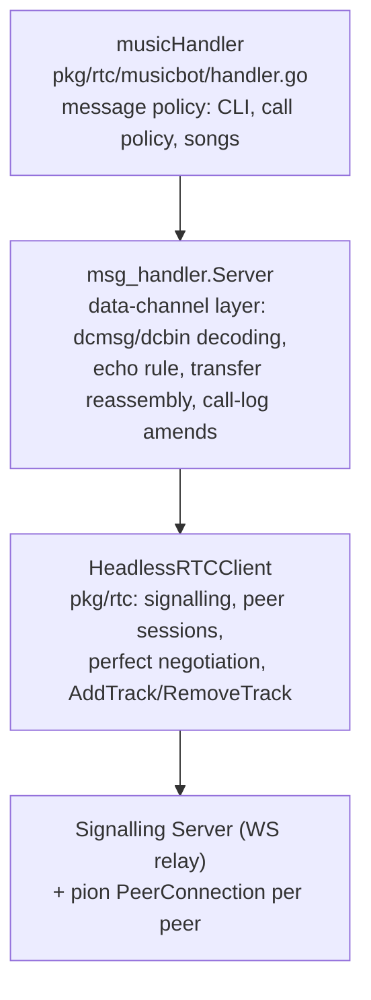
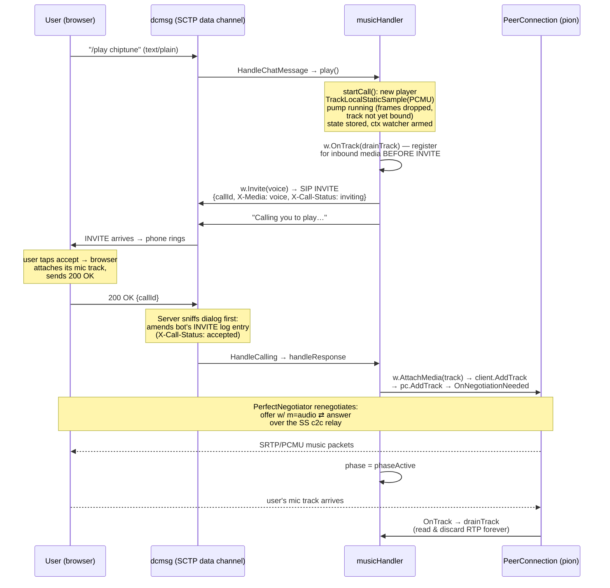

# Music Bot Handler — Workflow Analysis

## 1. Where `handler.go` sits: a three-layer bot stack

The music bot is not a standalone WebRTC program — it's the **policy layer** of a three-layer stack, each layer owning one concern:



- **`HeadlessRTCClient`** (`pkg/rtc/client.go`) is the Go counterpart of the browser client: it registers on the chat channel over WebSocket, discovers members, and runs one `peerSession` (a pion `PeerConnection` + `PerfectNegotiator`) per member. It exposes `AddTrack`/`RemoveTrack`/`HandleTrack`.
- **`msg_handler.Server`** (`pkg/rtc/msg_handler/server.go`) serves the two well-known data channels — `dcmsg` (JSON frames) and `dcbin` (binary file frames) — and distills raw frames into typed messages, exactly "the way an `http.Server` distills a connection's bytes into requests for an `http.Handler`". It owns all protocol mechanics: the echo rule, file reassembly/ACKs, and — notably — the caller-side call-log status amends.
- **`musicHandler`** implements `BotMessageHandler` and decides only what messages _mean_: chat is a CLI, attachments are refused, video calls are declined, voice calls are answered with music, `/play` on a quiet line phones the user.

Everything below the handler is invoked synchronously on the peer's data-channel goroutine — invocations for one peer's `dcmsg` channel are serialized (the framework's documented guarantee), which is what lets the handler keep per-peer state in a plain `sync.Map` with no extra locking.

## 2. The core architectural idea: calls ride the existing peer connection

This is the key WebRTC insight of the whole design (from `docs/signalling-server.md`):

> **A call creates no new connection.** The bot and the user already have one long-lived P2P `PeerConnection` (established when they discovered each other on the chat channel, negotiated via the MDN perfect-negotiation pattern over the SS relay). That connection carries the `dcmsg`/`dcbin` SCTP data channels. A "phone session" is **two decoupled layers on top of it**:

1. **The dialog (the cause)** — a _SIP subset with the SDP body stripped_, carried as `application/x-sip` DCMsg frames over `dcmsg`: `INVITE` / `200 OK` / `603 Decline` / `CANCEL` / `BYE`, plus `callId`, `X-Media` (voice|video — standing in for SDP `m=` lines) and `X-Call-Status` (UI state). These are _pure dialog verbs_ — they never carry or negotiate media descriptions, and unlike all other DCMsgs they are **never echoed** (like real SIP: each end advances state from its own sends and the peer's sends).
2. **The media (the effect)** — the actual SDP offer/answer for the audio flows _elsewhere_: through the SS's client-to-client relay between the pair's two `PerfectNegotiator`s, as an ordinary **renegotiation of the existing connection** triggered by adding/removing a track.

So "phoning the user" is: send an in-band SIP INVITE on the data channel → when accepted, `AddTrack` the music track to the _same_ peer connection → the negotiators renegotiate on their own → RTP flows over the already-established ICE/DTLS/SRTP transport. No ICE gathering, no TURN, no new handshake — media starts within one renegotiation round-trip.

## 3. State model

```go
calls sync.Map // ss.SubscriberId → *peerCall

type peerCall struct {
    outgoing bool        // bot opened the call (it is the caller)
    callId   string
    phase    callPhase   // phaseRinging (outbound, awaiting answer) | phaseActive
    player   *player     // the music source + outbound track
}
```

Discipline: fields are touched only from the peer's serialized `dcmsg` goroutine, plus two controlled exceptions — the session watcher goroutine (which only ever `CompareAndDelete`s) and the player's own mutex-guarded pump. This is the concurrency contract the whole file is built around.

## 4. Flow A — the bot phones the user (`/play <song>` on a quiet line)



Sequence inside `play()` (`handler.go`):

1. **Validate** the song name against the songbook; unknown → usage hint.
2. **Mid-call case**: if `calls.Load(peer)` finds state, it just calls `call.player.setSong(s)` — a mutex-guarded pointer swap, _no renegotiation_ — and confirms with "Now playing…" (active) or "Will play … when you answer" (still ringing).
3. **Fresh call**: `startCall()` prepares everything _before_ any signalling:
   - `newPlayer(song)` creates the `webrtc.TrackLocalStaticSample` with the PCMU capability (8 kHz, mono — PCMU's native rate).
   - the pump goroutine starts immediately;
   - state is stored in `calls`;
   - a watcher goroutine waits on the **session ctx** (which survives glare rebuilds — it _is_ the session) and stops the music + drops state when the peer session ends.
4. `call.outgoing = true`, then **`w.OnTrack(h.drainTrack)` is registered _before_ the INVITE goes out**, so the user's mic track — which the browser attaches on accept — can never arrive before the bot has registered interest in it.
5. **`w.Invite(MediaVoice)`** (in `response_writer.go`): mints a UUID callId, sends the SIP INVITE DCMsg over `dcmsg`, and posts an `inviteSentNote` to the Server's hub — this is how the Server takes over the caller's logged-status duty (below). Errors unwind cleanly: state deleted, pump stopped, user told "Could not call you: …".
6. Reply: "Calling you to play 'chiptune'…".

When the user's **200 OK** arrives, `serveMessages` routes it (no echo for SIP frames), the Server's hub folds it into its outgoing-call record and amends the INVITE's chat-log entry, and `handleResponse`:

- verifies the dialog (`call.outgoing && call.callId == sip.CallId`) and the phase (`phaseRinging` — duplicate answers are ignored),
- calls **`w.AttachMedia(track)`** → `client.AddTrack(peer, track)` → hub note → `sess.pc.AddTrack(track)`. pion creates an audio transceiver and fires `OnNegotiationNeeded`; the session's `PerfectNegotiator` drives the offer/answer over the relay automatically — **no SDP work ever reaches the handler**.
- sets `phaseActive`. If attach fails (session gone), the call stands answered but carries no music — the peer can still hang up, which resets state.

A **603 Decline** instead deletes the state, stops the pump, and sends "Call declined." (threaded on the peer's 603 — a known cosmetic quirk noted in the session memory, since the frontend doesn't render that thread anchor).

## 5. Flow B — the user phones the bot (incoming INVITE)

`HandleCalling` dispatches on method/response:

- **Video INVITE → declined immediately**: `w.Reject(603, "Decline")`. The bot is audio-only by policy.
- **Voice INVITE → `handleInvite` → `acceptCall`**:
  - a second INVITE from the same peer **supersedes**: old player stopped, old state `CompareAndDelete`d, old track `DetachMedia`d, new call taken.
  - `startCall` with the songbook's default song (`h.songs[h.order[0]]`), phase set to `phaseActive` immediately (the bot is the callee; once it answers, it's live), `OnTrack` registered.
  - **`w.Accept(track)`** has a deliberate ordering: it calls `client.AddTrack` **first**, and only sends the 200 OK if the attach succeeded — "a failed attach (a gone session) sends no OK", so the caller never sees an accepted call that carries no media. The track offer and the 200 OK are two different planes (renegotiation vs. dialog), and this order makes the failure mode safe.
  - Then: "Now playing 'chiptune'." threaded on the INVITE (which is the call's log entry in the user's history).

**Hangup (`BYE`/`CANCEL`)** → `handleHangup`: match the callId (a BYE for a different/unknown dialog is ignored), `CompareAndDelete` the state, `player.stop()`, `w.DetachMedia(track)` → `client.RemoveTrack` — keyed **by track, never by sender**, because a glare rebuild swaps the `RTPSender` while the track survives. Removing renegotiates again, withdrawing the m-line.

## 6. How the music actually streams

This is the most interesting part from a WebRTC-media perspective — a fully programmatic source with zero codec dependencies.

**Composition → PCM → μ-law, done once at init** (`song.go`, `mulaw.go`):

- The one song, "chiptune", is an 8-bar C-major pentatonic loop (melody + bass voices, 120 BPM ≈ 16 s), synthesized at **8 kHz mono** — PCMU's native rate, so μ-law bytes map 1:1 onto RTP payload bytes.
- Additive sine synth: fundamental + octave (×0.3) + twelfth (×0.15) partials under a pluck envelope (10 ms linear attack, exponential decay, fade over the note's last tenth) — the fade makes note _and loop_ boundaries click-free, so the infinite loop wrap is inaudible.
- Normalized to 0.7 full scale, padded with silence to a whole number of 160-sample frames, then **μ-law encoded once** with a pure-Go G.711 encoder (canonical ITU-T/Sun bit trick — bias 0x84, clip 32635). PCMU was chosen deliberately: every browser's WebRTC stack offers it, and unlike Opus it needs no codec library — a table-free compander in 20 lines.

**The pump — real-time RTP** (`player.go`):

- A `time.Ticker` at **20 ms** (the standard audio frame duration) drives the loop; each tick copies the next 160-byte frame from the song loop (plain modulo wrap) and calls `track.WriteSample(media.Sample{Data: frame, Duration: 20ms})`.
- `TrackLocalStaticSample` + pion's track binding turn each sample into RTP packets with **duration-driven timestamps** (advancing 160 ticks per frame at the 8 kHz clock), the negotiated payload type, and the sender's SSRC — then out through the session's SRTP sender. The ticker keeps the stream wall-clock-real-time.
- The pump is deliberately forgiving about the track lifecycle: while the track is **unbound** — during ringing (outbound call, before the user's 200 OK attaches it) or mid glare-rebuild — `WriteSample` silently drops frames. The song position simply advances "as if the music played to an empty room." No special-casing of the unbound window anywhere.
- The pump dies on its `stopCh` (call ended — `sync.Once`-guarded), the session ctx (peer gone), or a write error. (Pion hygiene verified in the session memory: `pc.Close()` → transceiver stop → `ReplaceTrack(nil)` → `Unbind`, so the shared track re-binds cleanly on the rebuilt connection after glare.)

**Mid-call song switch** is a purely _local, media-plane_ operation: `setSong` swaps the song pointer and resets the offset under the pump's mutex. Same track, same codec, same sender — **no renegotiation, no SIP message**. The next 20 ms tick simply reads from the new loop. This is the cleanest expression of the design's layering: dialog verbs on `dcmsg`, media changes via renegotiation, and _content_ changes that need neither.

**Inbound audio**: the bot has no use for the user's voice, but an unread remote track would pile up in pion's receiver buffers — so `drainTrack` spawns a goroutine looping on `track.ReadRTP()` and discarding every packet until the track/connection ends.

## 7. What the user experiences (browser side)

Per the design doc, the browser counterpart is symmetric:

1. The INVITE DCMsg arrives on `dcmsg`; `usePhoneCalls` folds it into state — **its arrival is what rings** — and stores it as the call's log entry with `X-Call-Status: inviting`.
2. On accept, `useCallMedia` attaches the user's microphone track to the _same_ peer connection (`PeerSessions.addTrack`); the browser's own negotiator renegotiates (any glare with the bot's simultaneous offer resolved by the polite/impolite rule — lexicographically smaller subscriber id is polite).
3. The bot's music track arrives via `ontrack`, is routed through the shared `AudioContext` graph (per-call gain, FFT analyser, shared speaker gain), plus a muted `<audio>` element — a workaround for Chromium issue 40094084, where a WebRTC stream attached only to WebAudio is never decoded.
4. The bot-side Server keeps amending the INVITE's log entry (`inviting → accepted → ended/cancelled/rejected`) via chat-control amends, so the history entry follows the dialog — the Go mirror of the frontend's `usePhoneCalls` amend effect.

## 8. Robustness details worth noting

| Concern                                 | Mechanism                                                                                                                                                                                                                                                                                                                                                                                                                                                                                       |
| --------------------------------------- | ----------------------------------------------------------------------------------------------------------------------------------------------------------------------------------------------------------------------------------------------------------------------------------------------------------------------------------------------------------------------------------------------------------------------------------------------------------------------------------------------- |
| **Glare (colliding renegotiations)**    | pion can't roll back a pending local offer like browsers do, so the polite peer **rebuilds the whole PeerConnection** (`handleRebuildNote`). The client re-adds the session's tracks to the fresh PC _before_ answering — so the answer still carries `m=audio` and music resumes. The handler survives because it holds only the session ctx (not the PC) and its state map; the Server's `OnTrack` registration lives in a separate hub map precisely so the `peerRecord` swap can't lose it. |
| **Race: answer before INVITE recorded** | `inviteSentNote` is posted to the hub _after_ the wire send, so a same-instant 200 OK could fold before the record exists. Known benign: the next status drift self-heals (same property as the frontend's effect).                                                                                                                                                                                                                                                                             |
| **Cancel/accept race**                  | Both ends fold dialog statuses as the precedence maximum (`inviting < accepted < ended < cancelled < rejected`) — settles identically regardless of arrival order; terminal states drop the record forever.                                                                                                                                                                                                                                                                                     |
| **Stale dialog messages**               | Every response/BYE/CANCEL is matched against `callId` before touching state; unknown or superseded dialogs are no-ops.                                                                                                                                                                                                                                                                                                                                                                          |
| **Peer disappears mid-call**            | The session ctx cancels → watcher stops the pump and drops state; `peerDownNote` clears the Server's registrations. No BYE needed.                                                                                                                                                                                                                                                                                                                                                              |
| **Slow handler**                        | Handlers run synchronously on the channel goroutine — a slow handler stalls its channel (like a slow `http.Handler` stalls its connection). The musicbot's handlers are all O(1) + data-channel sends.                                                                                                                                                                                                                                                                                          |

## 9. History (git + session memory)

- `03f0517` _Added RTC bot_ built layer 1 (`HeadlessRTCClient`) and the echo bot; `f562029` _Add music bot_ (~3,000 lines) is the commit in question: it added the musicbot package **and** completed the framework's media support that made it possible — `AddTrack`/`RemoveTrack`/`HandleTrack` on the client, `Accept`/`Reject`/`Invite`/`AttachMedia`/`DetachMedia`/`OnTrack` on `ResponseWriter`, track fan-out in the Server, and the caller-side `X-Call-Status` amend sniffing.
- Session memory `.ai/memory/sessions/24.md` records the one mid-course design correction: the caller's logged-status duty was _planned_ for the `ResponseWriter` surface but moved **down into the Server** by user directive — it's protocol conditioning "like the classical-conditioning echo", never the message policy's concern. That's why `handler.go` contains zero call-log code despite initiating calls.
- The same memory notes the bug the test suite caught: `/play` originally forgot `call.outgoing = true`, so the bot ignored the answer to its own call — which is why that assignment sits prominently before the INVITE today.

### One-line summary

`handler.go` is a pure policy object: it translates chat lines into SIP-subset dialog verbs over the pair's existing data channel, and translates dialog events into track attach/detach operations on the pair's existing peer connection — while a 20 ms ticker pump feeds pre-encoded μ-law frames into a pion local track, so "a phone call" is really one long-lived WebRTC connection gaining and losing a single audio m-line, with all negotiation automated by the perfect-negotiation layer beneath it.
