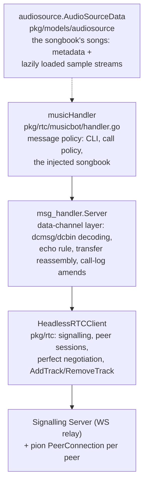
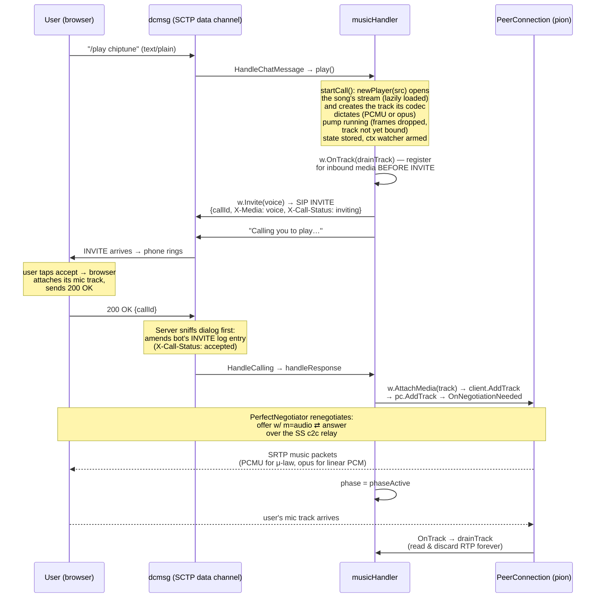

# Music Bot Handler — Workflow Analysis

## 1. Where `handler.go` sits: a three-layer bot stack

The music bot is not a standalone WebRTC program — it's the **policy layer** of a three-layer stack, each layer owning one concern:



- **`HeadlessRTCClient`** (`pkg/rtc/client.go`) is the Go counterpart of the browser client: it registers on the chat channel over WebSocket, discovers members, and runs one `peerSession` (a pion `PeerConnection` + `PerfectNegotiator`) per member. It exposes `AddTrack`/`RemoveTrack`/`HandleTrack`.
- **`msg_handler.Server`** (`pkg/rtc/msg_handler/server.go`) serves the two well-known data channels — `dcmsg` (JSON frames) and `dcbin` (binary file frames) — and distills raw frames into typed messages, exactly "the way an `http.Server` distills a connection's bytes into requests for an `http.Handler`". It owns all protocol mechanics: the echo rule, file reassembly/ACKs, and — notably — the caller-side call-log status amends.
- **`musicHandler`** implements `BotMessageHandler` and decides only what messages _mean_: chat is a CLI, attachments are refused, video calls are declined, voice calls are answered with music, `/play` on a quiet line phones the user. Its songbook is **injected** — `Configuration.AudioSources`, authored as the configuration document's `<audioSource/>` entries and modeled by `pkg/models/audiosource`'s `AudioSourceData` (see §6) — never hardcoded: songs are data, and the CLI addresses them by their `Name`.

Everything below the handler is invoked synchronously on the peer's data-channel goroutine — invocations for one peer's `dcmsg` channel are serialized (the framework's documented guarantee), which is what lets the handler keep per-peer state in a plain `sync.Map` with no extra locking.

## 2. The core architectural idea: calls ride the existing peer connection

This is the key WebRTC insight of the whole design (from `docs/signalling-server.md`):

> **A call creates no new connection.** The bot and the user already have one long-lived P2P `PeerConnection` (established when they discovered each other on the chat channel, negotiated via the MDN perfect-negotiation pattern over the SS relay). That connection carries the `dcmsg`/`dcbin` SCTP data channels. A "phone session" is **two decoupled layers on top of it**:

1. **The dialog (the cause)** — a _SIP subset with the SDP body stripped_, carried as `application/x-sip` DCMsg frames over `dcmsg`: `INVITE` / `200 OK` / `603 Decline` / `CANCEL` / `BYE`, plus `callId`, `X-Media` (voice|video — standing in for SDP `m=` lines) and `X-Call-Status` (UI state). These are _pure dialog verbs_ — they never carry or negotiate media descriptions, and unlike all other DCMsgs they are **never echoed** (like real SIP: each end advances state from its own sends and the peer's sends).
2. **The media (the effect)** — the actual SDP offer/answer for the audio flows _elsewhere_: through the SS's client-to-client relay between the pair's two `PerfectNegotiator`s, as an ordinary **renegotiation of the existing connection** triggered by adding/removing a track.

So "phoning the user" is: send an in-band SIP INVITE on the data channel → when accepted, `AddTrack` the music track to the _same_ peer connection → the negotiators renegotiate on their own → RTP flows over the already-established ICE/DTLS/SRTP transport. No ICE gathering, no TURN, no new handshake — media starts within one renegotiation round-trip.

## 3. State model

```go
// musicHandler (static after construction):
songs map[string]*audiosource.AudioSourceData // the songbook, by Name
order []string                                // the listing order

calls sync.Map // ss.SubscriberId → *peerCall

type peerCall struct {
    outgoing bool        // bot opened the call (it is the caller)
    callId   string
    phase    callPhase   // phaseRinging (outbound, awaiting answer) | phaseActive
    player   *player     // the track + the streaming music pump
}
```

Discipline: the call fields are touched only from the peer's serialized `dcmsg` goroutine, plus one controlled exception — the session watcher goroutine, which only ever `CompareAndDelete`s. The player below them is an **actor**: its pump goroutine alone owns the open stream and the encoder, and a mid-call song switch reaches it as a request on a channel (never a lock — the project dislikes mutexes). This is the concurrency contract the whole file is built around.

## 4. Flow A — the bot phones the user (`/play <song>` on a quiet line)



Sequence inside `play()` (`handler.go`):

1. **Validate** the song name against the songbook; unknown → usage hint.
2. **Mid-call case**: if `calls.Load(peer)` finds state, `switchSong` applies the new song — **within a codec family** (μ-law → μ-law, linear PCM → linear PCM) it is a stream swap inside the player (`setSource`, a request the pump applies between frames — open-new-first, so a failed switch keeps the old song playing; _no renegotiation_); **across families** the track's codec changes with the song, so the whole player is replaced (attach the new track before detaching the old, so the music never leaves the wire). Confirms with "Now playing…" (active) or "Will play … when you answer" (still ringing).
3. **Fresh call**: `startCall()` prepares everything _before_ any signalling:
   - `newPlayer(ctx, src)` opens the song's stream — the source's first touch, the lazy load — and creates the `webrtc.TrackLocalStaticSample` whose codec the source's format dictates (PCMU for μ-law, opus for linear PCM; see §6). A source that fails to open (missing file, hung URL, an unsupported FLAC header) fails here, while nothing is on the wire yet.
   - the pump goroutine starts immediately;
   - state is stored in `calls`;
   - a watcher goroutine waits on the **session ctx** (which survives glare rebuilds — it _is_ the session) and stops the music + drops state when the peer session ends.
4. `call.outgoing = true`, then **`w.OnTrack(h.drainTrack)` is registered _before_ the INVITE goes out**, so the user's mic track — which the browser attaches on accept — can never arrive before the bot has registered interest in it.
5. **`w.Invite(MediaVoice)`** (in `response_writer.go`): mints a UUID callId, sends the SIP INVITE DCMsg over `dcmsg`, and posts an `inviteSentNote` to the Server's hub — this is how the Server takes over the caller's logged-status duty (below). Errors unwind cleanly: state deleted, pump stopped, user told "Could not call you: …".
6. Reply: "Calling you to play 'chiptune'…".

When the user's **200 OK** arrives, `serveMessages` routes it (no echo for SIP frames), the Server's hub folds it into its outgoing-call record and amends the INVITE's chat-log entry, and `handleResponse`:

- verifies the dialog (`call.outgoing && call.callId == sip.CallId`) and the phase (`phaseRinging` — duplicate answers are ignored),
- calls **`w.AttachMedia(track)`** → `client.AddTrack(peer, track)` → hub note → `sess.pc.AddTrack(track)`. pion creates an audio transceiver and fires `OnNegotiationNeeded`; the session's `PerfectNegotiator` drives the offer/answer over the relay automatically — **no SDP work ever reaches the handler**.
- sets `phaseActive`. If attach fails (session gone), the call stands answered but carries no music — the peer can still hang up, which resets state.

A **603 Decline** instead deletes the state, stops the pump, and sends "Call declined." (threaded on the peer's 603 — a known cosmetic quirk noted in the session memory, since the frontend doesn't render that thread anchor).

## 5. Flow B — the user phones the bot (incoming INVITE)

`HandleCalling` dispatches on method/response:

- **Video INVITE → declined immediately**: `w.Reject(603, "Decline")`. The bot is audio-only by policy.
- **Voice INVITE with an empty songbook → left unanswered**: there is no song to answer with (a warn log; the caller may cancel). The degenerate wiring is handled, not crashed.
- **Voice INVITE → `handleInvite` → `acceptCall`**:
  - a second INVITE from the same peer **supersedes**: old player stopped, old state `CompareAndDelete`d, old track `DetachMedia`d, new call taken.
  - `startCall` with the songbook's default song (`h.songs[h.order[0]]`), phase set to `phaseActive` immediately (the bot is the callee; once it answers, it's live), `OnTrack` registered.
  - **`w.Accept(track)`** has a deliberate ordering: it calls `client.AddTrack` **first**, and only sends the 200 OK if the attach succeeded — "a failed attach (a gone session) sends no OK", so the caller never sees an accepted call that carries no media. The track offer and the 200 OK are two different planes (renegotiation vs. dialog), and this order makes the failure mode safe.
  - Then: "Now playing …" threaded on the INVITE (which is the call's log entry in the user's history).

**Hangup (`BYE`/`CANCEL`)** → `handleHangup`: match the callId (a BYE for a different/unknown dialog is ignored), `CompareAndDelete` the state, `player.stop()`, and `w.DetachMedia(track)` → `client.RemoveTrack` — keyed **by track, never by sender**, because a glare rebuild swaps the `RTPSender` while the track survives. Removing renegotiates again, withdrawing the m-line — but not immediately: the peer is tearing down its own side of the call at the same instant, and its offer racing the withdrawal's is a glare the polite yield can only answer with a rebuild, whose fresh ICE/DTLS identity kills the transport for a browser (see `docs/signalling-server.md`). The withdrawal therefore waits `hangupDetachDelay` out of the way — the music is already off, so the m-line's removal can afford to go out after the peer's offer, alone.

## 6. How the music actually streams

Songs are data now, and the data is a **stream** — loaded lazily, never held as a whole. Three pieces make it work.

**The model — `AudioSourceData`** (`pkg/models/audiosource`):

- A song is metadata (the sample format, the numeric type, the channel count, the rate) plus a location: inline bytes (base64 in the XML) or a URL — an http(s) URL or a filesystem path, relative ones resolving against the configuration document's directory. `numTotalSamples` of **0 denotes a streaming source** of unknown length.
- Three format combinations are accepted: **linear PCM, 48 kHz, stereo**; **μ-law, 8 kHz, mono**; and **Ogg-framed opus, 48 kHz, 1 or 2 channels**. `Compression="flac"` wraps the data in a FLAC stream; the file header's stream info takes precedence over the declared metadata — it surfaces on the opened stream's `Format()`, and the effective combination must still be one of the accepted ones. `Compression="ogg"` frames the data as an Ogg Opus stream (RFC 7845): the ID header's channel count and declared input rate take precedence the same way — and the input rate must be 48000, or the source is refused at open.
- `Open(ctx)` returns a fresh `Stream` (`io.Closer` + `Rewind(ctx)` + `Format()`), decoding on demand — a FLAC frame decodes when it is read, an HTTP body streams from the wire. A sample family's stream also implements `io.Reader` (a `SampleStream`), positioned at the first sample; an opus source's stream is a `PacketStream` instead, serving whole opus packets with their media durations — the packets are already the audio, so nothing decodes them. No state lives on the source; sources need no synchronization and are shared by pointer.

**The codec follows the song — nothing is downmixed, decoded or re-encoded unless it must be** (`player.go`, `convert.go`):

- A **μ-law song rides a PCMU track** (8 kHz, mono): its companded bytes become the RTP payload _byte for byte_ — the playing path is a pure passthrough. (The pure-Go G.711 encoder that produced those bytes lives in the asset generator, `cmd/synthchiptune`, not in the bot.)
- A **linear PCM song rides an opus track** (48 kHz, stereo — both codecs are in pion's default media engine, and every browser offers them): the decoded samples only change representation — libopus encodes integers and floats alike, so an integer source normalizes to the interleaved signed 16-bit stereo of the integer API (s16 itself takes a bit-exact fast path; u8/u16/s32 normalize through [-1, 1]) while a float source rides the float API in its own shape — and the encoder (libopus, `github.com/hraban/opus`, cgo) writes one 96 kbit/s packet per 20 ms frame. The song keeps its rate, its channels and its fidelity.
- An **opus song rides the same opus track with no codec at all**: the demuxed packets (pion's `pkg/oggreader`, in `github.com/pion/opus`) pass from the stream to the wire byte for byte, each written with the duration its page's granule position measured. This is the family an internet radio stream belongs to — and the one linear-quality family a pure-Go build plays, needing no encoder.
- The encoder sits behind Go's implicit `cgo` build tag: a pure-Go build (the cross-compiled binaries, the scratch container image) compiles a stub — its music bot plays μ-law and opus songs and reports the limitation for linear PCM ones when a call tries to prepare one.

**The pump — real-time RTP from a stream** (`player.go`):

- For the sample families a `time.Ticker` at **20 ms** (the standard audio frame duration) drives the pump; each tick reads exactly one frame — 160 bytes on the PCMU path, 960 stereo pairs encoded to one opus packet on the linear PCM one — through `readLooping`, which rewinds the stream at its end so the song **plays indefinitely**: local files and inline data _seek_ back to their first byte, HTTP re-fetches, a streaming source restarts from its beginning just the same. A frame straddling the stream's end takes its tail from the stream's beginning; only two consecutive end-of-data reads without a byte set off the "holds no samples" guard (one is the boundary case of a previous fill that consumed the stream exactly to its last byte).
- For the opus family the packets pace themselves: the pump reads one packet, writes it with the duration the stream measured off the pages' granule positions, and waits only until the media time written so far has caught the wall clock — a looping source plays at its own speed, while a live remote stream, whose reads block on the network's arrival, runs at real time already and never waits. A truncated final packet is discarded and the loop restarts at the first packet. Control messages (stop, session end, a song switch) are serviced between every two packets — never only inside the pacing wait, which a self-paced live stream never enters.
- `WriteSample(media.Sample{Data, Duration})` hands the frame or packet to pion with **duration-driven timestamps** (160 ticks at the 8 kHz clock, the opus codec's own 48 kHz on the other paths), and the SRTP sender carries it. The pacing keeps the stream wall-clock-real-time; a network stall simply freezes the music until data arrives again.
- The pump is deliberately forgiving about the track lifecycle: while the track is **unbound** — during ringing (outbound call, before the user's 200 OK attaches it) or mid glare-rebuild — `WriteSample` silently drops frames. The stream's position simply advances "as if the music played to an empty room." No special-casing of the unbound window anywhere.
- The pump is an actor: it alone owns the open stream, the normalizer and the encoder. A same-family song switch travels in as a request and is applied between frames (the new stream opens first; on failure the old song keeps playing). The pump dies on its `stopCh` (call ended — `sync.Once`-guarded), the session ctx (peer gone), or a stream error. (Pion hygiene verified in the session memory: `pc.Close()` → transceiver stop → `ReplaceTrack(nil)` → `Unbind`, so the track re-binds cleanly on the rebuilt connection after glare.)

**The shipped example song** is `assets/chiptune.ulaw` — an 8-bar C-major pentatonic loop (melody + bass voices, 120 BPM ≈ 16 s), rendered once by the one-off `go run ./cmd/synthchiptune`: an additive sine synth (fundamental + octave ×0.3 + twelfth ×0.15 under a pluck envelope whose last-tenth fade makes loop wraps click-free), normalized to 0.7 full scale, μ-law encoded (bias 0x84, clip 32635), byte-deterministic. The composition once lived in `song.go`; the audio source model made songs data instead, so the synthesizer became a generator you re-run, not code the bot carries.

**Mid-call song switch** stays a purely _local, media-plane_ operation within a family: same track, same codec, same sender — **no renegotiation, no SIP message**; the next 20 ms tick simply reads from the new stream. Across families it is a track replacement (see §4). This is the cleanest expression of the design's layering: dialog verbs on `dcmsg`, media changes via renegotiation, and _content_ changes that need neither.

**Inbound audio**: the bot has no use for the user's voice, but an unread remote track would pile up in pion's receiver buffers — so `drainTrack` spawns a goroutine looping on `track.ReadRTP()` and discarding every packet until the track/connection ends.

## 7. What the user experiences (browser side)

Per the design doc, the browser counterpart is symmetric:

1. The INVITE DCMsg arrives on `dcmsg`; `usePhoneCalls` folds it into state — **its arrival is what rings** — and stores it as the call's log entry with `X-Call-Status: inviting`.
2. On accept, `useCallMedia` attaches the user's microphone track to the _same_ peer connection (`PeerSessions.addTrack`); the browser's own negotiator renegotiates (any glare with the bot's simultaneous offer resolved by the polite/impolite rule — lexicographically smaller subscriber id is polite).
3. The bot's music track arrives via `ontrack` — PCMU or opus, both universally offered — and is routed through the shared `AudioContext` graph (per-call gain, FFT analyser, shared speaker gain), plus a muted `<audio>` element — a workaround for Chromium issue 40094084, where a WebRTC stream attached only to WebAudio is never decoded.
4. The bot-side Server keeps amending the INVITE's log entry (`inviting → accepted → ended/cancelled/rejected`) via chat-control amends, so the history entry follows the dialog — the Go mirror of the frontend's `usePhoneCalls` amend effect.

## 8. Robustness details worth noting

| Concern                                 | Mechanism                                                                                                                                                                                                                                                                                                                                                                                                                                                                                                                                                                                                                                                                                                                                                                                                                                                                 |
| --------------------------------------- | ------------------------------------------------------------------------------------------------------------------------------------------------------------------------------------------------------------------------------------------------------------------------------------------------------------------------------------------------------------------------------------------------------------------------------------------------------------------------------------------------------------------------------------------------------------------------------------------------------------------------------------------------------------------------------------------------------------------------------------------------------------------------------------------------------------------------------------------------------------------------- |
| **Glare (colliding renegotiations)**    | pion can't roll back a pending local offer like browsers do, so the polite peer **rebuilds the whole PeerConnection** (`handleRebuildNote`). The client re-adds the session's tracks to the fresh PC _before_ answering — so the answer still carries `m=audio` and music resumes. The handler survives because it holds only the session ctx (not the PC) and its state map; the Server's `OnTrack` registration lives in a separate hub map precisely so the `peerRecord` swap can't lose it. **Caveat (browser-facing)**: the rebuilt PC's fresh ICE/DTLS identity cannot be folded into the browser's running transport — a glare against a browser kills the pair until a re-registration (see `docs/signalling-server.md` _Current limitations_), so the flows are sequenced to avoid colliding at all (the hangup withdrawal waits the peer's teardown offer out). |
| **Answer DTLS role**                    | pion's defaults answer an `actpass` offer with `setup:active`, flipping the initial offerer's DTLS-server role — Chrome refuses ("Failed to set SSL role") and wedges in `have-local-offer`, breaking every later renegotiation (a song switch's track replacement included — that read as "no sound"). The peer-connection factories pin the role from the session's politeness: the polite side (the initial offerer) answers `setup:passive`.                                                                                                                                                                                                                                                                                                                                                                                                                          |
| **Race: answer before INVITE recorded** | `inviteSentNote` is posted to the hub _after_ the wire send, so a same-instant 200 OK could fold before the record exists. Known benign: the next status drift self-heals (same property as the frontend's effect).                                                                                                                                                                                                                                                                                                                                                                                                                                                                                                                                                                                                                                                       |
| **Cancel/accept race**                  | Both ends fold dialog statuses as the precedence maximum (`inviting < accepted < ended < cancelled < rejected`) — settles identically regardless of arrival order; terminal states drop the record forever.                                                                                                                                                                                                                                                                                                                                                                                                                                                                                                                                                                                                                                                               |
| **Stale dialog messages**               | Every response/BYE/CANCEL is matched against `callId` before touching state; unknown or superseded dialogs are no-ops.                                                                                                                                                                                                                                                                                                                                                                                                                                                                                                                                                                                                                                                                                                                                                    |
| **Peer disappears mid-call**            | The session ctx cancels → watcher stops the pump and drops state (the open stream closes with it); `peerDownNote` clears the Server's registrations. No BYE needed.                                                                                                                                                                                                                                                                                                                                                                                                                                                                                                                                                                                                                                                                                                       |
| **Song fails to load or decode**        | A source's first touch is `newPlayer` (fresh call) or the switch request (mid-call) — both open the new stream _before_ touching the current one, so a failed open answers with an error line while the current song keeps playing; on a fresh call nothing was on the wire yet ("Could not prepare the track — the call is off."). An http source's fetch and every read are ctx-scoped, so a hung URL unwinds with the session.                                                                                                                                                                                                                                                                                                                                                                                                                                         |
| **A stream that ends early or late**    | When a source's length is known (`numTotalSamples` > 0, or a FLAC header's count), the stream cross-checks its decoded bytes at end-of-data — a truncated file is an error the pump logs and stops on, not a silently short song. An opus stream checks the same way, in the granule deltas' samples. A streaming source (count 0) checks nothing and restarts on rewind.                                                                                                                                                                                                                                                                                                                                                                                                                                                                                                 |
| **Mid-call switch races the pump**      | The switch is a request on the player's channel, applied between frames by the pump itself — no shared mutable state. If the pump has already died, `setSource` answers the stopped error instead of hanging.                                                                                                                                                                                                                                                                                                                                                                                                                                                                                                                                                                                                                                                             |
| **No libopus (pure-Go build)**          | The opus encoder is behind the `cgo` build tag; a stub build fails a linear PCM song's preparation with an explanatory error, while μ-law and opus songs play unaffected — the opus family needs no codec at all, so a pure-Go bot still plays a remote radio stream at full quality.                                                                                                                                                                                                                                                                                                                                                                                                                                                                                                                                                                                     |
| **Slow handler**                        | Handlers run synchronously on the channel goroutine — a slow handler stalls its channel (like a slow `http.Handler` stalls a connection). The musicbot's handlers are O(1) + data-channel sends, save the deliberate first-touch opens (a lazy load) on a fresh call or a switch.                                                                                                                                                                                                                                                                                                                                                                                                                                                                                                                                                                                         |

## 9. History (git + session memory)

- `03f0517` _Added RTC bot_ built layer 1 (`HeadlessRTCClient`) and the echo bot; `f562029` _Add music bot_ (~3,000 lines) added the musicbot package **and** completed the framework's media support that made it possible — `AddTrack`/`RemoveTrack`/`HandleTrack` on the client, `Accept`/`Reject`/`Invite`/`AttachMedia`/`DetachMedia`/`OnTrack` on `ResponseWriter`, track fan-out in the Server, and the caller-side `X-Call-Status` amend sniffing. In that era the one song was hardcoded, synthesized in `song.go`, and the player copied 160-byte μ-law frames out of an in-memory loop.
- Session memory `.ai/memory/sessions/24.md` records the one mid-course design correction of that build: the caller's logged-status duty was _planned_ for the `ResponseWriter` surface but moved **down into the Server** by user directive — it's protocol conditioning "like the classical-conditioning echo", never the message policy's concern. That's why `handler.go` contains zero call-log code despite initiating calls. The same memory notes the bug the test suite caught: `/play` originally forgot `call.outgoing = true`, so the bot ignored the answer to its own call.
- The **audio source model rework** (`pkg/models/audiosource`, session 25 — `.ai/memory/sessions/25.md`) made songs data: injected from the configuration document's `<audioSource/>` entries, streamed lazily (`Open`/`Rewind`, `numTotalSamples` 0 = streaming, FLAC header precedence), played on a per-song codec (PCMU passthrough for μ-law, opus 48 kHz stereo for linear PCM — no downmixing, per user directive), looped by rewinding streams (files seek, HTTP re-fetches — per user directive), with the whole player mutex-free (the actor redesign, also per user directive). `song.go` became the one-off `cmd/synthchiptune` generator and `assets/chiptune.ulaw`; the cgo opus encoder carries a pure-Go stub for the CGO_ENABLED builds.
- The **opus family** (session 28 — `.ai/memory/sessions/28.md`; see `docs/opus-streaming-postmortem.md` for the full debugging narrative) added the third accepted combination: Ogg-framed opus at 48 kHz (per user directive — the 44.1 kHz PCM idea it replaced would have needed resampling to the codec's own clock). An opus source demuxes with pion's `pkg/oggreader` (`github.com/pion/opus`), serves whole packets with durations from each packet's own table of contents — never from the pages' granule positions, which are arbitrary for a live stream — and rides the wire byte for byte: no decoding, no re-encoding, no cgo. The same session removed the float32 → s16 conversion stage on user review (libopus's float API takes a float source in its own shape), fixed the packet pump's control discipline for self-paced live streams, fixed the polite side's answer DTLS role (a flip Chrome refuses), and sequenced the hangup's track withdrawal behind the peer's teardown offer so the two offers never collide into a glare rebuild a browser cannot survive.

### One-line summary

`handler.go` is a pure policy object: it translates chat lines into SIP-subset dialog verbs over the pair's existing data channel, and translates dialog events into track attach/detach operations on the pair's existing peer connection — while a mutex-free pump reads out of a lazily opened, rewind-looping audio source stream (μ-law songs passing through as PCMU, linear PCM songs encoded to opus at their native rate and channels, opus songs passing through as they came), so "a phone call" is really one long-lived WebRTC connection gaining and losing a single audio m-line, with all negotiation automated by the perfect-negotiation layer beneath it and all songs living in the configuration document, not the source.
