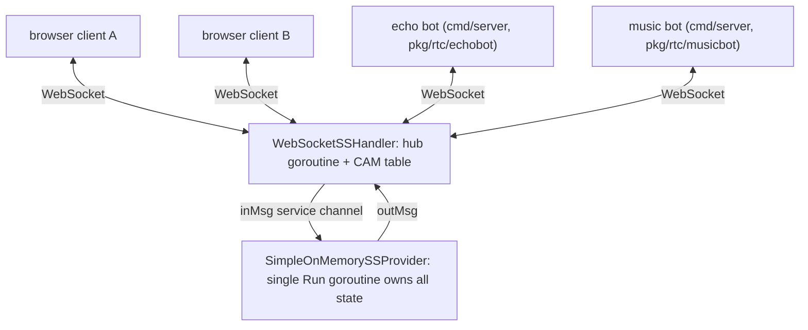

# Signalling server

The signalling sub-system lets the site's visitors discover each other and
broker WebRTC session establishment (session descriptions and trickle ICE
candidates) between them. Client identity comes from the caller's JWT
session (see _Identity_). It is a prototype: only the main channel
exists, and all state lives in process memory.

## Components

| Layer            | Location                           | Role                                                                                                                                                                                                      |
| ---------------- | ---------------------------------- | --------------------------------------------------------------------------------------------------------------------------------------------------------------------------------------------------------- |
| Wire prototype   | `web/site/src/api/ss/types.ts`     | The browser-side TypeScript prototype; the source of truth for the wire format.                                                                                                                           |
| Model            | `pkg/models/ss`                    | Go wire types (field- and JSON-compatible with the prototype), the `SignallingServiceProvider` interface, and `SimpleOnMemorySSProvider`.                                                                 |
| Negotiator       | `web/site/src/api/ss/negotiate.ts` | Browser-side MDN perfect negotiation over the c2c relay (the prototype).                                                                                                                                  |
| Negotiator       | `pkg/rtc`                          | The Go counterpart of `negotiate.ts` on `pion/webrtc`: `Negotiator` interface + `PerfectNegotiator`, reading from and writing to Go channels.                                                             |
| Headless client  | `pkg/rtc` (`client.go`)            | `HeadlessRTCClient` — the Go counterpart of `useSignalling` + `usePeerSessions`: a bot peer driving one session per channel member, over a caller-supplied channel pair (see below).                      |
| Client transport | `pkg/rtc` (`transport.go`)         | `SignallingTransport`, the client's SSProxy: pumps a channel pair to/from the SS; `WebSocketSignallingTransport` is the production one.                                                                   |
| Echo bot         | `pkg/rtc/echobot`                  | The reference data-channel stack of an echo-purpose bot on `HeadlessRTCClient`: serves the well-known `dcmsg`/`dcbin` labels (see below).                                                                 |
| Bot DC layer     | `pkg/rtc/msg_handler`              | The data-channel layer of a bot: `Server` serves `dcmsg`/`dcbin` (echo rule, transfer reassembly and acks, the call log's status amends) and distills frames into bot messages for a `BotMessageHandler`. |
| Music bot        | `pkg/rtc/musicbot`                 | A music-purpose `BotMessageHandler`: chat CLI (`/help`, `/list-songs`, `/play`), voice calls answered with a song of the injected songbook (PCMU or opus, see `pkg/models/audiosource`), video declined.  |
| Transport        | `pkg/api/websocket_ss`             | `WebSocketSSHandler`, an `http.Handler` bridging WebSocket connections to a provider.                                                                                                                     |
| Wiring           | `cmd/server/main.go`               | Mounts the handler at `/api/ss/ws`, backed by the in-memory provider; when the configuration document carries an `<echoBot/>` or `<musicBot/>` element, also hosts the bots as clients of the endpoint.   |
| E2E tests        | `e2e/websocket_ss_test.go`         | Drives the real server binary over WebSocket with deliberately independent wire views.                                                                                                                    |

## Wire protocol

Every message is a single envelope, `SignallingEvent`:

- **`from` / `to` (`EPAddr`)** — packed addresses holding `userId`,
  `userSessionId`, or `serviceId`. A client may leave `from` empty — and
  anything it does send is discarded: the server handler overrides `from`
  with the request's session identity (see _Identity_).
- **`msgId`** — generated uniquely, statelessly, independently per message.
- **`inReplyTo`** — correlates a reply with the message it answers.
- **One payload slot**: `c2SEv` (client → SS), `s2CEv` (SS → client), or
  `c2CEv` (client ↔ client, relayed).

All identifier types (`UserId`, `UserSessionId`, `ServiceId`,
`SubscriberId`, `ChannelId`, `MsgId`) are opaque strings: implementations
must not guess or assume their formation. Two well-known ids exist: the SS
service itself (`253dc952-a55b-4d01-a885-c5e240e95fdb`) and the main
channel (`f887f5b0-7b78-4ceb-a051-f42879f9d98e`), the only channel an
implementation must provide.

### Client → SS (`c2SEv`)

- **`register {subscriberId, channelId, username}`** — registers the client
  as a subscriber of a channel. Answered by a
  `registerResult {channelId, subscriberId}` on success or an `err`
  otherwise. An **empty `subscriberId`** asks the SS to assign one,
  sequentially, from the automatic assignment range **1000-1999** (the
  assigned id comes back in `registerResult`; empty always creates a fresh
  subscriber, even from an already-registered tuple). Clients picking
  their own subscriber ids are recommended to **preserve the 1000-1999
  range** for automatic registration. A subscriber id is bound to zero or
  one (user id, user session id, channel id) tuple: re-registration of a
  live id by the same tuple is a refresh (renewing `lastActive`), while
  another tuple is rejected with `SubscriberIdIsRegistered`. The
  **`username`** is the subscriber's display name, but it is never the
  client's to choose: the WebSocket endpoint overrides it with the
  session's username (the JWT's username claim) before the event reaches
  the SS, so clients send it empty and `UsernameTaken` can only fire when
  two live sessions carry the same username claim.
- **`channelKeepAlive {channelId, subscriberId}`** — renews the caller's
  membership of a channel: the SS refreshes the subscriber's
  `lastActive`. Sent periodically once registered. **Nothing is answered
  on success**; an `err` is answered otherwise — `ChannelNotFound`, or
  `SubscriberNotFound` when the registration has expired or is bound to
  another (user id, user session id) tuple — meaning the membership is
  gone and the client should re-register.
- **`userProfileQuery {subscriberId, channelId}`** — answered with a
  `profile {subscriberId, channelId, username}` reply.
- **`listChannelMembers {channelId}`** — answered with **one or more**
  `channelMbsListResult {channelId, members, hasMore}` messages, all
  `inReplyTo` the request. `members` is a page of subscriber ids (resolve
  them via `userProfileQuery`). The client may time out on its own, or
  keep reading until `hasMore` is `false`; even an empty channel yields
  one final empty page.
- **`listChannels {}`** — dynamic channel discovery; carries no fields.
  Answered with **one or more** `channelListResult {channels, hasMore}`
  messages, all `inReplyTo` the request, with the same paging semantics
  as `listChannelMembers`. Resolve a channel's profile via
  `channelProfileQuery`.
- **`channelProfileQuery {channelId}`** — answered with a
  `channelProfile {channelId, channelName}` reply; an unknown channel
  yields `ChannelNotFound`.
- **`ping {pingId, sequenceNumber}`** — out-of-band liveness ping to the
  SS itself (browsers cannot send protocol-level WebSocket pings). **No
  registration is needed first.** Answered with a `pong` that keeps the
  ping id and carries `ackSequenceNumber = sequenceNumber + 1`; the pong's
  own sequence number is 0 (the SS keeps no per-session sequence space).

### SS → client (`s2CEv`)

Carries `err`, `registerResult`, `profile`, `channelProfile`, `pong`,
`channelMbsListResult`, or `channelListResult`. Every reply
comes `from` the well-known SS service id, is addressed `to` the origin's
`from`, and is correlated via `inReplyTo`. Errors pair a well-defined
`errorCode` with a descriptive `errorMsg`:

| Code | Name                       | Meaning                                                  |
| ---- | -------------------------- | -------------------------------------------------------- |
| 1    | `SubscriberIdIsRegistered` | subscriber id already registered                         |
| 2    | `SubscriberNotFound`       | subscriber not found in the given channel                |
| 3    | `ChannelNotFound`          | channel not found (only the main channel is implemented) |
| 4    | `UsernameTaken`            | username already taken in the channel                    |
| 5    | `NoSubscriberIdAvailable`  | no subscriber id free in the 1000-1999 auto-assign range |

### Client ↔ client relay (`c2CEv`)

Addressed by `{channelId, fromSubscriber, toSubscriber}` and carries
`sessionDesc` and `rtcICECandidate` (modelled with
`github.com/pion/webrtc/v4` types — `webrtc.SessionDescription` and
`webrtc.ICECandidateInit` — which marshal to the exact browser JSON
shapes), plus out-of-band `ping`/`pong`.

Think of a subscriber id as an IP address and the channel as the VLAN it
lives in: a subscriber id alone does not determine an endpoint, only
`(channelId, subscriberId)` does. There is deliberately a single channel
id — no from/to pair — because caller and callee are expected to be
registered in the same channel.

The sender addresses the event **to the SS**; the SS translates
`(channel, subscriber)` addressing into an `EPAddr` — learned from each
subscriber's `from` at registration — and **rewrites the envelope's `to`**
to the resolved destination. `from` and the payload pass through
unchanged. An unknown channel yields a `ChannelNotFound` error; an
unknown subscriber in it yields `SubscriberNotFound`.

`sessionDesc`/`rtcICECandidate` traffic is produced and consumed by the
perfect negotiators on each end (`negotiate.ts` in the browser,
`pkg/rtc` in Go). The pattern is the MDN perfect negotiation — the
lexicographically smaller subscriber id is the polite peer — with one
Go-side deviation: pion cannot roll a pending local offer back (the
browser's implicit rollback has no pion counterpart), so the polite Go
peer yields to a colliding offer by **rebuilding its peer connection**
through the caller-provided `NewPeerConnection` factory and answering
on the fresh one.

Ping sessions between clients follow the sequence rules: a `pong` keeps
the `pingId` and answers `ackSequenceNumber = sequenceNumber + 1`; the
next `ping`'s `sequenceNumber` is the ack of the last reply.

## In-band peer messaging (data channels)

Discovery and session establishment go through the SS, but chat traffic
itself never does: once the c2c relay has brokered the WebRTC handshake,
the two browsers talk **directly and in-band** over a point-to-point peer
connection. The browser-side session management lives in
`web/site/src/api/ss/peersessions.tsx`: `usePeerSessions` owns the peer
connections and hands their data channels out by label. Two sibling
consumers build on it, decoupled from each other: `useDataChannel` in
`datachannel.tsx` (the source of truth for the messaging frame format,
and the owner of the message store) subscribes `dcmsg`, and
`useBinaryDataChannel` in `binarydatachannel.tsx` subscribes `dcbin`
(see _Binary file transfer_). `usePeerSessions` also returns every
session's live `connectionState` (channel → peer → state); the
conversation header renders it — the presence line (Unconnected /
Connecting / Connected / Disconnected) and the avatar dot (green only
while connected) — in place of the listing's online flag, which only
says the peer's signalling client is connected.

The Go side's counterpart is `HeadlessRTCClient` (`pkg/rtc/client.go`) —
a headless peer, more of a bot than a full client. Its `Run` mirrors
`Negotiator.Negotiate` and `SignallingServiceProvider.Run`: it serves a
caller-supplied pair of channels (inbound/outbound `SignallingEvent`s),
so the client knows nothing about WebSockets or authentication. It
registers as a channel subscriber (SS-assigned or configured id, with
the browser's retry-on-conflict), keeps the membership alive, renews the
member listing, and reconciles one peer session per member. Data
channels are dispatched by label to handlers registered with
`HandleDataChannel` — the `http.ServeMux.Handle` shape; like the
browser's `usePeerSessions`, the client hardcodes no label: `dcmsg`,
`dcbin`, and any other protocol belong to the caller. Media mirrors the
browser too: `AddTrack`/`RemoveTrack` attach and detach a session's
local tracks (the negotiator renegotiates on its own, and a glare
rebuild re-adds the tracks to the rebuilt connection), and remote tracks
arrive at the handler registered with `HandleTrack` — the counterpart of
`PeerSessions.subscribeTracks`.

A bot built on the client is three layers. The client is the bot client
(above). `pkg/rtc/msg_handler` is the data-channel layer: its `Server`
serves the two well-known labels and owns every sub-message protocol
mechanic — the echo rule (every accepted message is bounced back verbatim
with `echo` set; echoes and SIP dialog messages are never bounced), the
strict FILE-frame reassembly (a gap, an overlap, or a mismatched `total`
drops the transfer), the per-frame acknowledgement, and the call log's
conditioning: the Server sniffs the call dialogs and amends the INVITEs
of the bot's own outgoing calls as their status moves (the caller's
X-Call-Status duty — below the interface, like the echo rule). It
distills the raw frames into bot messages — a plain-text chat line, one
accepted chunk of a file transfer, a completely transferred file
attachment, a call dialog message — and hands them to a
`BotMessageHandler`, which answers through the invocation's
`ResponseWriter`: a chat reply, an amendment of an earlier message, a
call's final response (Accept/Reject), an outgoing call (`Invite`), and
the call's media — local tracks offered with Accept/AttachMedia (pion
`TrackLocal`s on the pair's existing peer connection), the peer's inbound
media arriving at the registered OnTrack callback. The reference
`BotMessageHandler` is `pkg/rtc/echobot`:
an echo-purpose policy that answers a plain-text chat line with a fresh
message of identical content, declines every incoming call — voice or
video — with a `603 Decline`, and reports every inbound file's running
sha256 over the session's messaging channel: a `sha256:<hex>` chat
message opened at the first chunk (referring back to the transfer's
announcement) and amended via chat control, throttled to one amend per
500 chunks except that the first and the final chunk always report, so
the report opens immediately and ends on the complete digest. The file's
bytes are never retained — the hash is the deliverable, and it is
complete the moment the last chunk lands.

The second handler is `pkg/rtc/musicbot`, the music bot: chat with it is
a CLI — `/help`, `/list-songs`, and `/play <song>`, which phones the
user (the bot's own voice INVITE) and plays the song once accepted, or
switches it mid-call. An incoming voice call is accepted and answered
with the music; a video call is declined on the spot; an attachment of
any kind is refused with a chat reply.

The songbook is injected — the `<musicBot/>` element's `<audioSource/>`
children, modeled by `pkg/models/audiosource`'s `AudioSourceData`:
sample data in a declared format (two combinations accepted — linear
PCM at 48 kHz stereo, or G.711 μ-law at 8 kHz mono), inline (base64
text) or at a url (a filesystem path or an http URL), optionally FLAC
compressed (the file header's stream info taking precedence over the
declared metadata), with a `numTotalSamples` of 0 denoting a streaming
source of unknown length. Sample data loads lazily, as a stream: a
call's player opens the song when it first plays it and reads each
20 ms frame on demand, rewinding the stream at its end so the song
plays indefinitely. The track's codec follows the song — a μ-law song
rides PCMU, its bytes becoming the RTP payload as they are; a linear
PCM song rides opus (48 kHz stereo, among the codecs every browser
offers), encoded frame by frame with nothing downmixed or resampled
(the opus encoder is libopus through cgo; pure-Go builds compile a
stub whose μ-law songs play unaffected). The shipped example song is
`assets/chiptune.ulaw` — an eight-bar pentatonic loop, synthesized to
8 kHz mono μ-law by the one-off `go run ./cmd/synthchiptune`. The
peer's own audio is drained and discarded.

The server binary itself hosts the bots when the configuration document
carries an `<echoBot/>` or `<musicBot/>` element (see `serverConfig.xsd`):
`cmd/server`
drives them over a `WebSocketSignallingTransport` to the configured
endpoint — typically the same server's own `/api/ss/ws` — with the
configured session token as their credential, reconnecting when the
connection drops. The token doubles as the bot's whole identity: the
endpoint stamps its subject/session onto the bot's events, and its
username claim is the registration's display name, like every client's.
To the signalling server the bot is an ordinary authenticated client and
needs no special casing anywhere; the element's attributes (channel,
subscriber id, ICE servers, the periodic knobs) map onto
`RTCClientConfiguration`.

- **One peer connection, two data channels per pair.** A consumer
  subscribes a data-channel label and every session brings one up: the
  polite peer (the smaller subscriber id) creates it — the first
  creation starts perfect negotiation over the c2c relay — the impolite
  peer receives it via `ondatachannel`, dispatched by label. `dcmsg`
  carries the JSON DCMsgs below, `dcbin` carries compact binary frames
  (see _Binary file transfer_). Sessions track the channel membership:
  they appear as the listing discovers members and are torn down when a
  member drops out.
- **ICE servers** come from `GET /api/iceServers` (the `<iceServer/>`
  entries of `serverConfig.xml`), so a deployment can steer peers at its
  own STUN/TURN instance.
- **Echo.** A data channel does not echo; the recipient bounces every
  message back with `echo: true` so the sender sees its own message.
  Echoes are never echoed again. Both sides therefore build the same
  history from the same frames. The one exception is the call protocol
  (`application/x-sip`): like real SIP, a dialog message is never
  bounced — the sender records its own copy at send time, so a call's
  behavior never depends on an echo.

Every frame is one JSON `DCMsg`: `mimeVersion` (`1.0`), `channelId`,
`fromSubscriberId`, `toSubscriberId`, `creationTimestamp` (Unix seconds),
`msgId`, optional `inReplyTo`, optional `echo`, a `mimeType` body-kind
tag, and the body. Malformed frames are dropped silently, mirroring the
SS's rule for malformed events.

| `mimeType`                           | Body                                                                                                               | Meaning                                                                                                                                                                                                                                                                     |
| ------------------------------------ | ------------------------------------------------------------------------------------------------------------------ | --------------------------------------------------------------------------------------------------------------------------------------------------------------------------------------------------------------------------------------------------------------------------- |
| `text/plain`                         | `plaintext`                                                                                                        | A plain-text chat line.                                                                                                                                                                                                                                                     |
| `application/x-file-transfer-status` | `fileTransfer {fileId, kind, filename, fileMIMEType, fileSizeTotalBytes, fileSizeTransferred, fileTransferStatus}` | The UI state of a file transfer (`pending` → `running` → `done`). The file's bytes never travel in the message; the opaque, globally unique `fileId` is the handle a recipient passes back to fetch them.                                                                   |
| `application/x-chat-control`         | `chatControl {subtype, targetMessageId, text?, fileTransfer?, sip?}`                                               | Mutates the UI state of one of the sender's earlier messages instead of adding a line — the result of something, never its cause.                                                                                                                                           |
| `application/x-sip`                  | `sip {callId, method?/response?, X-Media?, X-Call-Status?}`                                                        | One message of a call's SIP-subset dialog (see _Phone sessions_): the caller's INVITE (stored, rendered as the call's log entry; its arrival rings the callee), the callee's response (`200 OK` / `603 Decline`), the caller's CANCEL, or either party's BYE. Never echoed. |

Chat-control semantics: `delete` drops the target message; `amend`
rewrites the target's body — `text` for a text message, `fileTransfer`
for a file-transfer status, `sip` for a call's INVITE (which must also
be an INVITE naming the target dialog's own `callId`) — while
keeping its `msgId` and `creationTimestamp`, so an amendment never moves
or reattributes a message. Only the sender's own messages can be
targeted; unknown targets and body-kind mismatches are no-ops. A chat
control only ever mutates **UI state**: it is how one end tells the
other "display this differently now", the _result_ of something that
already happened — a file transfer's acknowledgements advancing, a call
dialog's messages unfolding — never the _cause_; the actions themselves
are their own frames (the `dcbin` acknowledgement frames, the SIP
dialog's messages). The receiver applies a control message on
arrival, the sender when its echo comes back, so both histories stay
identical; control messages themselves are never stored.

### Binary file transfer (`dcbin`)

The second data channel of every pair carries compact binary frames; the
source of truth for the format is `web/site/src/api/ss/binaryframes.ts`
(the codec), and the transfer engine is `useBinaryDataChannel` in
`binarydatachannel.tsx`, which owns the `dcbin` label and builds its
transport directly on `usePeerSessions`' sessions — not on
`useDataChannel`. All multi-byte integers are big-endian.
Two frame kinds exist, selected by the 4-byte ASCII `frame_type`:

`FILE` — one (possibly fragmented) block of a file, sender → receiver; a
48-byte header followed by the payload:

| Offset | Size | Field                                                                                          |
| ------ | ---- | ---------------------------------------------------------------------------------------------- |
| 0      | 4    | `frame_type` — ASCII `FILE`                                                                    |
| 4      | 16   | `file_id` — the file's UUID, packed into 16 bytes                                              |
| 20     | 4    | `seq` — uint32, per-`file_id` frame sequence from 0 (a `file_id` is a stream; files multiplex) |
| 24     | 8    | `offset` — uint64 byte offset of the payload in the original file (the first frame's is 0)     |
| 32     | 8    | `total` — uint64 size of the whole file in bytes                                               |
| 40     | 8    | `payload_size` — uint64 size of the payload; must equal the remaining frame length             |
| 48     | var  | `payload` — the (possibly fragmented) file content                                             |

`FACK` — receiver → sender acknowledgement of the contiguous prefix of a
file's stream received so far; 32 bytes, no payload:

| Offset | Size | Field                                                                                   |
| ------ | ---- | --------------------------------------------------------------------------------------- |
| 0      | 4    | `frame_type` — ASCII `FACK`                                                             |
| 4      | 16   | `file_id` — the file's UUID, packed into 16 bytes                                       |
| 20     | 4    | `ack_seq` — uint32, cumulative: the next expected seq (one past the highest contiguous) |
| 24     | 8    | `acked_bytes` — uint64, cumulative: the contiguously received byte count                |

The sender streams a file in 16 KiB chunks with at most 64 frames
(1 MiB) unacknowledged — a sliding window over the per-file frame
sequence, which is also the send-side flow control — and the receiver
acknowledges every accepted frame. SCTP delivery is ordered and
reliable, so reassembly is strict concatenation: a gap, an overlap or a
mismatched `total` marks the stream corrupt and the transfer is dropped.
An empty file is one `FILE` frame with an empty payload.

The transfer's status rides `dcmsg`, never `dcbin`: `sendFile` returns a
reader yielding the transfer's status (`pending` → `running` → `done`)
as the receiver's acknowledgements advance — throttled to a few updates
per second — and the caller forwards every status as a chat-control
amend of the original file-transfer-status message, whose echo updates
the sender's own history; both UIs therefore render what the receiver
actually holds, in real time. Completed files stay in memory on both
ends: the receiver hands its reassembled Blob out by
`getFileByFileId(fileId)`, the sender registers the original File under
the same id, so a completed card downloads from whichever side clicks it.

A transfer message's render kind is the sender's explicit choice,
carried in the body's `kind` field — `file` renders the download card,
`image` / `video` render inline media cards (a progress doughnut while
transferring, a borderless card opening a preview dialog once done). It
is chosen by the composer's attach menu (attachment / photo / video,
whose only other effect is the file dialog's `accept` filter) and is
never derived from the file's MIME type; the transfer path over `dcbin`
is the same for all three.

### Phone sessions (voice and video calls)

A call — voice or video — is a phone session between one (channel,
subscriber) pair, managed per pair and deliberately decoupled from the
peer connection's own signalling state: it rides the same per-pair
connection as the messaging and binary channels — no dedicated
connection is created for a call. Two deliberately separate layers:

- **The session protocol — the cause.** The actions are a SIP subset
  with the SDP body stripped: `application/x-sip` DCMsgs (body `sip`),
  one per dialog action. The caller opens the dialog with an INVITE —
  stored on both ends as the call's log entry; its arrival is what
  rings the callee. The callee answers the INVITE with a final
  response — `200 OK` (accept) or `603 Decline` (reject); the caller
  aborts the ring with a CANCEL (before the answer); either party hangs
  an established call up with a BYE. The body carries the dialog's
  identifier (`callId` — SIP's Call-ID) and its start line (a request
  `method` XOR a `response` status line); what cannot be expressed in
  standard SIP terms rides as extension headers (X-*): `X-Media` says
  what the call carries — `voice` (the default when absent) attaches
  the microphones only, `video` additionally the cameras (see _Media
  and audio_) — standing in for the stripped SDP body's `m=` lines; and
  `X-Call-Status` carries the UI state (below). The SDP body is
  stripped because this system's actual SDP offer/answer lives
  elsewhere: it rides the SS's client-to-client relay between the two
  ends' PerfectNegotiators as the pair's peer connection negotiates and
  renegotiates — these messages are pure dialog verbs. The subset also
  omits SIP's ACK and CSeq (SCTP delivery is ordered and reliable, and
  the state fold is order-independent) and — unlike every other DCMsg
  kind — a dialog message is **never echoed**: like real SIP, each end
  advances its own state from its own sends (recorded locally at send
  time) and the peer's sends (received), never from a bounce. Each end
  folds the dialog's messages into its protocol state (`usePhoneCalls`)
  as the precedence maximum over `inviting` < `accepted` < `ended` <
  `cancelled` < `rejected`, so a cancel/accept race settles identically
  on both ends and a terminal session is never revived. Media attach
  and the live indicators (the answer popup, the sidebar pills, the
  conversation strip) read this state.
- **The session's UI state — the dependent variable.** The INVITE's
  stored `X-Call-Status` header is what the history's log entry
  displays; it only ever follows the protocol state. When a session's
  protocol state has moved on from its logged status, the session's
  owner — the caller, the INVITE's author — reports the new UI state
  with a chat-control `amend` of the INVITE (a `sip` body: the INVITE
  again, `X-Call-Status` updated), exactly like a file transfer's
  sender amends its status message as acknowledgements arrive. Chat
  control is a separate layer with its own echo discipline and its
  own-messages-only rule — the SIP dialog never echoes and never
  depends on chat control.

Media and audio:

- When a session reaches `accepted`, both ends attach their microphone
  track to the pair's existing peer connection (`useCallMedia` via
  `PeerSessions.addTrack`); the PerfectNegotiator renegotiates on its
  own, resolving the glare of the two near-simultaneous offers. Leaving
  `accepted` removes the track — and the mic capture itself stops when
  the last accepted call detaches, so the browser's recording indicator
  lights exactly while a call is sending. Remote tracks arrive via
  `ontrack` (`PeerSessions.subscribeTracks`).
- A video call additionally attaches the local camera track — a plain
  `getUserMedia({ video: true })` capture in `useCallMedia`,
  reference-counted between concurrent video calls exactly like the
  mic — and keeps the peer's incoming video track as its own
  MediaStream. The videos render in floating, draggable, borderless
  cards scoped to the chat app, not the conversation (`VideoWindow`):
  one peer view per accepted video call, captioned with the peer's
  name, plus one mirrored "me" preview while the camera sends. The
  cards' video elements are muted: the call's audio keeps flowing
  through the audio graph below, so the volume menu and the FFT taps
  apply unchanged. A denied camera degrades the call, never fails it —
  a video call without a camera is a voice call.
- All call audio runs through one shared `AudioContext`
  (`web/site/src/api/audio/audiograph.tsx`, provided like the SSProxy
  singleton): the microphone passes a gain node (the mic send volume)
  and an analyser (the local FFT) into a
  `MediaStreamAudioDestinationNode` whose track goes on the wire; every
  peer's incoming stream passes an analyser (the remote FFT) into one
  shared gain node (the speaker volume) feeding the output — several
  accepted calls mux there. The capture states the voice-processing
  constraints (echo cancellation, noise suppression, auto gain)
  explicitly — browsers turn the processing on when they are merely
  omitted, so "off" says false — and falls back to a plain
  `{ audio: true }` capture when the constraint solver rejects them
  (Firefox answers even `false` with `NotFoundError` on a backend
  lacking the named capability). The call audio menu's
  echo-cancellation toggle switches the processing on, live via
  `applyConstraints` and for future captures (headphones assumed while
  it is off). Autoplay policies only let the `AudioContext` start
  inside a user gesture: `resume()` runs from the call UI's click
  handlers (call, accept), and a context found suspended by a
  gesture-less path (a peer's track off the wire) is resumed by an
  unlock listener on the next gesture anywhere in the document. Every
  remote stream is additionally attached to a muted `<audio>` element:
  Chrome never decodes a WebRTC-received stream that is only attached
  to WebAudio (chromium issue 40094084, unfixed since M56 — Safari and
  Firefox decode such streams natively), so without the media element
  pulling it the track stays muted and the graph sees silence; the
  graph alone carries the audible path.
- A peer dropping out mid-call ends the session locally (a dead-session
  overlay — there is nobody left to exchange the dialog with); the log
  entry keeps its last logged status.

### Magic commands

The composer intercepts three debugging commands on send — a message
matching one is never sent as text but turned into the corresponding
chat-control message (`web/site/src/components/chat/magic.ts`):

- `/magic a90926e3-c768-45b7-ab93-4709c5f4aa91 <target_msg_id>` — delete
  the target message.
- `/magic 1f734b69-9c46-4629-9e73-0aed96166f7c <target_msg_id> <content>` —
  amend a text chat message (`content` may contain spaces).
- `/magic 7f8d9d4e-f41e-4e18-958e-ebc990690666 <target_msg_id> <status> <transferred> <total>` —
  amend a file-transfer status message (`status` is `pending`, `running`
  or `done`; the sizes are byte counts).

Amendments copy the target's immutable fields (a file transfer's
`fileId`, name and MIME type) from the local history, so an unknown
target id or a kind mismatch makes the command a no-op.

## Addressing and routing

- The provider is the **only** component that understands subscriber
  addressing; it resolves `(channel, subscriberId)` → `EPAddr`.
- The WebSocket handler **never learns subscriber ids**. Like a learning
  switch, it builds the association between a connection's remote
  `ip:port` and the `(userId, userSessionId)` pair purely by sniffing the
  `from` field of inbound messages (after the identity override).
- Outbound events are routed by their `to` EPAddr to **every
  connection the address was learned on** — one address can map to
  several connections (two tabs sharing a session, or a reconnect whose
  old connection has not been noticed closed yet); there is no flooding
  beyond that. Events whose destination was never learned are dropped;
  a disconnect purges the closed connection from all of its learned
  addresses (link-down aging), and a reconnect re-learns onto the new
  connection.

**Roaming.** Registrations outlive connections (the prototype has no
unregister message), and ping-session state (ping id, seq/ack chain) is
purely client-side — so a client that quickly disconnects and reconnects
with the same identity keeps its registration, its profile stays
queryable (even while it is offline), and in-flight ping sessions
continue transparently on the new connection — as long as it reconnects
within the aging interval (below). The only requirement is that the
reconnected client speaks first — any message (e.g. a liveness `ping`)
re-learns its address onto the new connection, switch-style.

## Subscriber aging

Every subscriber carries a `lastActive` timestamp, refreshed by any
activity from its learned address — including c2s liveness pings — and
explicitly by `channelKeepAlive`, so a client that pings periodically
keeps its registration alive. A
registration whose `lastActive` is longer ago than the aging interval
(the `--ss-aging` server flag, default `10s`) is considered invalid:
profile queries answer `SubscriberNotFound`, relays fail, and the
subscriber id and username are free again. Expiration is **lazy** —
there is no timer: the list-members operation does an all-at-once
mark-and-sweep of a channel's expired entries, while every other
operation just tests the validity of the specific subscriber before
using it (evicting that single entry if it has expired).

## Concurrency model

Both stateful components follow the CSP pattern — no mutexes on any data
path:

- **Provider** (`SimpleOnMemorySSProvider`): the single `Run` goroutine
  owns all state (channels → subscribers) on its own stack and is fed
  exclusively by `inMsg`, the service channel; replies and relays go to
  `outMsg`, which `Run` closes on return. `Shutdown` is idempotent
  (`sync.Once`) and takes priority over buffered input. Buffered channels
  provide natural backpressure.
- **Handler** (`WebSocketSSHandler`): one hub goroutine owns the
  connection set and the CAM table; each connection has a read pump
  (parse JSON, populate `from`, forward to the hub's ingress channel) and
  a write pump (drain a per-connection queue to the socket, write
  deadline configurable via `WriteTimeout`, default 10s). A full queue makes a slow consumer get dropped rather than
  stall the hub. The hub exits on context cancellation or provider
  shutdown, closing every queue, which cascades to connection closure.

One integration detail: `pkg/log`'s logging `responseWriter` implements
`Hijack` explicitly, because `gorilla/websocket`'s upgrader type-asserts
`http.Hijacker` directly instead of going through
`http.ResponseController` — without the passthrough, every upgrade behind
the logging middleware would fail with 500.

## Identity

Client identity comes from the caller's session — the JWT cookie of the
site's login system (see the README's _Sign-in and sessions_): the
session's subject id is the user id and the session id is the user
session id. The endpoint is **not** on the server's JWT whitelist, so
every connection belongs to an authenticated session: a request without
one never reaches the handler (the auth middleware answers `401`), and a
session carrying no identity (an empty subject or session id) is
rejected with `400` before the upgrade.

The session is trusted, the wire is not: the handler **overrides** the
`from` EPAddr of every inbound message with the connection's session
identity — a client-supplied `from` is untrusted input and is discarded
— and applies the same discipline to the register event's `username`,
overridden with the session's username (the JWT's username claim), so a
client never picks its own display name. Machine clients that cannot log
in interactively (the built-in bots) carry a static session token issued
by the server binary's `sign` subcommand; to the endpoint they are
ordinary authenticated sessions.

## Current limitations

- **In-memory only.** Registrations are lost on restart.
- **No unregister/leave message** in the prototype — registration state
  lives until it ages out (see _Subscriber aging_) or the provider's
  `Run` returns.
- **Malformed events are dropped silently** — the prototype defines no
  error code for them.
- **Username format** (lowercase, no-space, valid DNS label) is declared
  by the prototype but not validated server-side.
- Channel member pages are fixed at 64 members.

## Testing

- `pkg/models/ss` and `pkg/api/websocket_ss` carry `-race`-clean unit
  suites: registration and its error codes, profile query, c2s ping/pong
  session rules, channel-keepalive renewal and its error codes, relay
  pass-through with `to` rewriting, member-list paging, shutdown/close
  semantics, handshake rejection when the session carries no identity,
  forged-`from` and forged-username overriding, unicast routing, and
  address re-learning across reconnects. (The suite drives identity
  through test-only headers mapped onto the session middleware's context
  values, keeping the dial sites unchanged.)
- `e2e/websocket_ss_test.go` exercises the real built server binary:
  register + profile, a 3-round c2c ping/pong session (seq/ack chaining),
  RTC payload pass-through, the members list, c2s ping before
  registration, and handshake rejection without a session — all dialled
  with real issued session tokens. Its wire views are deliberately
  independent copies, so accidental wire-format drift fails there.
