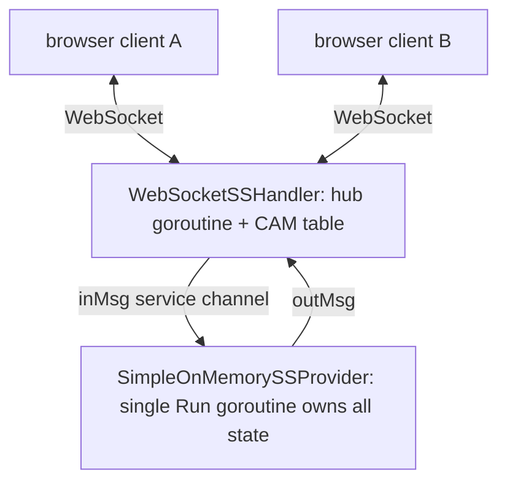

# Signalling server

The signalling sub-system lets the site's visitors discover each other and
broker WebRTC session establishment (session descriptions and trickle ICE
candidates) between them. It is a prototype: client identity comes from
experimental HTTP headers, only the main channel exists, and all state lives
in process memory.

## Components

| Layer          | Location                       | Role                                                                                                                                      |
| -------------- | ------------------------------ | ----------------------------------------------------------------------------------------------------------------------------------------- |
| Wire prototype | `web/site/src/api/ss/types.ts` | The browser-side TypeScript prototype; the source of truth for the wire format.                                                           |
| Model          | `pkg/models/ss`                | Go wire types (field- and JSON-compatible with the prototype), the `SignallingServiceProvider` interface, and `SimpleOnMemorySSProvider`. |
| Transport      | `pkg/api/websocket_ss`         | `WebSocketSSHandler`, an `http.Handler` bridging WebSocket connections to a provider.                                                     |
| Wiring         | `cmd/server/main.go`           | Mounts the handler at `/api/ss/ws`, backed by the in-memory provider.                                                                     |
| E2E tests      | `e2e/websocket_ss_test.go`     | Drives the real server binary over WebSocket with deliberately independent wire views.                                                    |

## Wire protocol

Every message is a single envelope, `SignallingEvent`:

- **`from` / `to` (`EPAddr`)** — packed addresses holding `userId`,
  `userSessionId`, or `serviceId`. A browser client may leave `from` empty;
  the server handler populates it from the request's identity headers.
- **`msgId`** — generated uniquely, statelessly, independently per message.
- **`inReplyTo`** — correlates a reply with the message it answers.
- **One payload slot**: `c2SEv` (client → SS), `s2CEv` (SS → client), or
  `c2CEv` (client ↔ client, relayed).

All identifier types (`UserId`, `UserSessionId`, `ServiceId`,
`SubscriberId`, `ChannelId`, `MsgId`) are opaque strings: implementations
must not guess or assume their formation. Two well-known ids exist: the SS
service itself (`253dc952-a55b-4d01-a885-c5e240e95fdb`) and the main
channel (`f887f5b0-7b78-4ceb-a051-f42879f9d98e`), the only channel an
implementation must provide.

### Client → SS (`c2SEv`)

- **`register {subscriberId, channelId, username}`** — registers the client
  as a subscriber of a channel. Answered by a
  `registerResult {channelId, subscriberId}` on success or an `err`
  otherwise. An **empty `subscriberId`** asks the SS to assign one,
  sequentially, from the automatic assignment range **1000-1999** (the
  assigned id comes back in `registerResult`; empty always mints a fresh
  subscriber, even from an already-registered tuple). Clients picking
  their own subscriber ids are recommended to **preserve the 1000-1999
  range** for automatic registration. A subscriber id is bound to zero or
  one (user id, user session id, channel id) tuple: re-registration of a
  live id by the same tuple is a refresh (renewing `lastActive`,
  optionally updating the username), while another tuple is rejected
  with `SubscriberIdIsRegistered`.
- **`userProfileQuery {subscriberId, channelId}`** — answered with a
  `profile {subscriberId, channelId, username}` reply.
- **`listChannelMembers {channelId}`** — answered with **one or more**
  `channelMbsListResult {channelId, members, hasMore}` messages, all
  `inReplyTo` the request. `members` is a page of subscriber ids (resolve
  them via `userProfileQuery`). The client may time out on its own, or
  keep reading until `hasMore` is `false`; even an empty channel yields
  one final empty page.
- **`listChannels {}`** — dynamic channel discovery; carries no fields.
  Answered with **one or more** `channelListResult {channels, hasMore}`
  messages, all `inReplyTo` the request, with the same paging semantics
  as `listChannelMembers`. Resolve a channel's profile via
  `channelProfileQuery`.
- **`channelProfileQuery {channelId}`** — answered with a
  `channelProfile {channelId, channelName}` reply; an unknown channel
  yields `ChannelNotFound`.
- **`ping {pingId, sequenceNumber}`** — out-of-band liveness ping to the
  SS itself (browsers cannot send protocol-level WebSocket pings). **No
  registration is needed first.** Answered with a `pong` that keeps the
  ping id and carries `ackSequenceNumber = sequenceNumber + 1`; the pong's
  own sequence number is 0 (the SS keeps no per-session sequence space).

### SS → client (`s2CEv`)

Carries `err`, `registerResult`, `profile`, `channelProfile`, `pong`,
`channelMbsListResult`, or `channelListResult`. Every reply
comes `from` the well-known SS service id, is addressed `to` the origin's
`from`, and is correlated via `inReplyTo`. Errors pair a well-defined
`errorCode` with a descriptive `errorMsg`:

| Code | Name                       | Meaning                                                  |
| ---- | -------------------------- | -------------------------------------------------------- |
| 1    | `SubscriberIdIsRegistered` | subscriber id already registered                         |
| 2    | `SubscriberNotFound`       | subscriber not found in the given channel                |
| 3    | `ChannelNotFound`          | channel not found (only the main channel is implemented) |
| 4    | `UsernameTaken`            | username already taken in the channel                    |
| 5    | `NoSubscriberIdAvailable`  | no subscriber id free in the 1000-1999 auto-assign range |

### Client ↔ client relay (`c2CEv`)

Addressed by `{channelId, fromSubscriber, toSubscriber}` and carries
`sessionDesc` and `rtcICECandidate` (modelled with
`github.com/pion/webrtc/v4` types — `webrtc.SessionDescription` and
`webrtc.ICECandidateInit` — which marshal to the exact browser JSON
shapes), plus out-of-band `ping`/`pong`.

Think of a subscriber id as an IP address and the channel as the VLAN it
lives in: a subscriber id alone does not determine an endpoint, only
`(channelId, subscriberId)` does. There is deliberately a single channel
id — no from/to pair — because caller and callee are expected to be
registered in the same channel.

The sender addresses the event **to the SS**; the SS translates
`(channel, subscriber)` addressing into an `EPAddr` — learned from each
subscriber's `from` at registration — and **rewrites the envelope's `to`**
to the resolved destination. `from` and the payload pass through
unchanged. An unknown channel yields a `ChannelNotFound` error; an
unknown subscriber in it yields `SubscriberNotFound`.

Ping sessions between clients follow the sequence rules: a `pong` keeps
the `pingId` and answers `ackSequenceNumber = sequenceNumber + 1`; the
next `ping`'s `sequenceNumber` is the ack of the last reply.

## Addressing and routing

- The provider is the **only** component that understands subscriber
  addressing; it resolves `(channel, subscriberId)` → `EPAddr`.
- The WebSocket handler **never learns subscriber ids**. Like a learning
  switch, it builds the association between a connection's remote
  `ip:port` and the `(userId, userSessionId)` pair purely by sniffing the
  `from` field of inbound messages (after header population).
- Outbound events are routed by their `to` EPAddr to **every
  connection the address was learned on** — one address can map to
  several connections (two tabs sharing a session, or a reconnect whose
  old connection has not been noticed closed yet); there is no flooding
  beyond that. Events whose destination was never learned are dropped;
  a disconnect purges the closed connection from all of its learned
  addresses (link-down aging), and a reconnect re-learns onto the new
  connection.

**Roaming.** Registrations outlive connections (the prototype has no
unregister message), and ping-session state (ping id, seq/ack chain) is
purely client-side — so a client that quickly disconnects and reconnects
with the same identity keeps its registration, its profile stays
queryable (even while it is offline), and in-flight ping sessions
continue transparently on the new connection — as long as it reconnects
within the aging interval (below). The only requirement is that the
reconnected client speaks first — any message (e.g. a liveness `ping`)
re-learns its address onto the new connection, switch-style.

## Subscriber aging

Every subscriber carries a `lastActive` timestamp, refreshed by any
activity from its learned address — including c2s liveness pings, so a
client that pings periodically keeps its registration alive. A
registration whose `lastActive` is longer ago than the aging interval
(the `--ss-aging` server flag, default `10s`) is considered invalid:
profile queries answer `SubscriberNotFound`, relays fail, and the
subscriber id and username are free again. Expiration is **lazy** —
there is no timer: the list-members operation does an all-at-once
mark-and-sweep of a channel's expired entries, while every other
operation just tests the validity of the specific subscriber before
using it (evicting that single entry if it has expired).

## Concurrency model

Both stateful components follow the CSP pattern — no mutexes on any data
path:

- **Provider** (`SimpleOnMemorySSProvider`): the single `Run` goroutine
  owns all state (channels → subscribers) on its own stack and is fed
  exclusively by `inMsg`, the service channel; replies and relays go to
  `outMsg`, which `Run` closes on return. `Shutdown` is idempotent
  (`sync.Once`) and takes priority over buffered input. Buffered channels
  provide natural backpressure.
- **Handler** (`WebSocketSSHandler`): one hub goroutine owns the
  connection set and the CAM table; each connection has a read pump
  (parse JSON, populate `from`, forward to the hub's ingress channel) and
  a write pump (drain a per-connection queue to the socket, 10s write
  deadline). A full queue makes a slow consumer get dropped rather than
  stall the hub. The hub exits on context cancellation or provider
  shutdown, closing every queue, which cascades to connection closure.

One integration detail: `pkg/log`'s logging `responseWriter` implements
`Hijack` explicitly, because `gorilla/websocket`'s upgrader type-asserts
`http.Hijacker` directly instead of going through
`http.ResponseController` — without the passthrough, every upgrade behind
the logging middleware would fail with 500.

## Identity (experimental)

For now, client identity comes from two request headers:
`X-Exp-UserId` and `X-Exp-UserSessionId`. A handshake missing either is
rejected with `400` before the upgrade. This stands in for the future
cookie/JWT-based population described by the prototype.

## Current limitations

- **In-memory only.** Registrations are lost on restart.
- **No unregister/leave message** in the prototype — registration state
  lives until it ages out (see _Subscriber aging_) or the provider's
  `Run` returns.
- **Malformed events are dropped silently** — the prototype defines no
  error code for them.
- **Username format** (lowercase, no-space, valid DNS label) is declared
  by the prototype but not validated server-side.
- Channel member pages are fixed at 64 members.

## Testing

- `pkg/models/ss` and `pkg/api/websocket_ss` carry `-race`-clean unit
  suites: registration and its error codes, profile query, c2s ping/pong
  session rules, relay pass-through with `to` rewriting, member-list
  paging, shutdown/close semantics, header rejection, unicast routing,
  and address re-learning across reconnects.
- `e2e/websocket_ss_test.go` exercises the real built server binary:
  register + profile, a 3-round c2c ping/pong session (seq/ack chaining),
  RTC payload pass-through, the members list, c2s ping before
  registration, and handshake rejection. Its wire views are deliberately
  independent copies, so accidental wire-format drift fails there.
