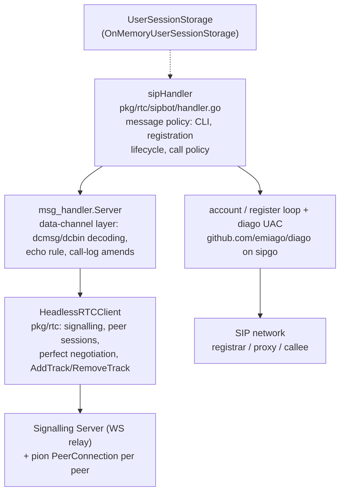

# SIP Bot — Design

Status: **design** (pre-implementation). The doc is the plan of record for
`pkg/rtc/sipbot`; deviations discovered during implementation are to be
folded back into it.

## 1. Purpose

The sip bot is a **session border controller (SBC)** between two voice
networks that share nothing but this host:

- the site's **WebRTC voice network** — the chat subsystem's phone
  sessions, where a call is an in-band SIP-subset dialog over the pair's
  `dcmsg` data channel plus an audio m-line on the pair's long-lived P2P
  peer connection (see `docs/signalling-server.md`, `docs/music-bot.md`);
- an external **SIP voice network** — any RFC 3261 registrar/Proxy the
  bot can reach over UDP (an Asterisk/FreeSWITCH/Kamailio, a residential
  VoIP provider, …).

In SIP terms the bot is a **B2BUA (back-to-back user agent)**: it
terminates both signalling planes and both media planes and relays each
into the other. It is a UAC toward the SIP network (REGISTER + INVITE)
and a headless bot peer toward the browser (the third policy bot on the
three-layer bot stack). The user in the browser can thus phone an
arbitrary SIP subscriber:

```
browser ──(WebRTC: SRTP, opus)──▶ SIP BOT ──(SIP/RTP: negotiated)──▶ PBX ──▶ callee
         dcmsg SIP-subset dialog            real SIP: REGISTER, INVITE,
         + renegotiated m-line              BYE; plain RTP media
```

Like the music bot and the echo bot, the bot is hosted by the server
binary as an ordinary authenticated signalling client
(`cmd/server/main.go`'s `startBotClient`), and like the music bot its
chat is a telegram-style CLI.

## 2. Position in the stack



- **webrtc-leg**: layers 1–3, identical to the music bot's. The audio
  codec toward the browser is **opus** (48 kHz), carried on a
  `TrackLocalStaticSample` attached to the pair's existing peer
  connection; the in-band dialog verbs (`INVITE`/`200 OK`/`CANCEL`/`BYE`)
  ride `dcmsg`. No new connection is ever created — "a call" is the pair's
  connection gaining an m-line, plus a SIP dialog on the other leg.
- **sip-leg**: one **shared** `diago.Diago` transaction user per bot
  process — one UDP socket, one sipgo UAC — on which every chat user's
  registration (a `diago.Register` loop) and every outbound call (a
  `diago.Invite` → `DialogClientSession`) is a separate SIP transaction
  stamped with that user's own identity (`From` + digest credentials).
  The codec toward the SIP network is **whatever the SDP negotiation
  settles on**; the bot offers, in preference order, **opus, PCMU, PCMA**
  (plus telephone-event, which the media relay ignores — see §10).

The two legs meet only inside the bot: signalling state is relayed by the
handler (§6), media by a per-call **relay** (§7).

## 3. The CLI

Chat lines, exactly like the music bot's commands:

| Command                              | Effect                                                                                                                                                                                                                  |
| ------------------------------------ | ----------------------------------------------------------------------------------------------------------------------------------------------------------------------------------------------------------------------- |
| `/help`                              | print the help/usage text                                                                                                                                                                                               |
| `/register <user@host> <password>`   | associate the chat user with the SIP credential, REGISTER the AOR `sip:user@host` against its host, and keep the registration alive (§5). A later `/register` re-registers (replaces the credential).                   |
| `/unregister`                        | cancel the registration (a SIP de-REGISTER goes out), drop the stored credential, and end any call in progress                                                                                                          |
| `/call <user@host>` (or bare `user`) | phone the callee through the SIP network and the user through the browser; one active call per chat user. A bare `user` is completed with the registered account's domain.                                              |
| `/test-call`                         | phone the configured test callee (the `<sipBot/>` element's `testSIPContact`, e.g. `9664@192.168.1.2`) — a known-good subscriber of the SIP network the deployment tests against; answers unavailable when unconfigured |
| `/hangup`                            | end the current call from chat (equivalent to the browser's hangup button)                                                                                                                                              |

Every command answers with a chat reply (`Reply`), threaded on the
command. Unknown commands and attachments are answered like the music
bot's (`Unrecognized command — try /help.`, an attachment refusal).
Incoming **video** calls are declined with 603 exactly like the music
bot; incoming **voice** calls (the browser phoning the bot) are declined
too in v1 — the bot is an outbound SBC, and accepting an inbound browser
call has no SIP meaning without a registered routing target (see §10).

Prompt-deficiency note: the request's "`/registered` command" is read as
the `/register` command defined alongside it; there is no separate
`/registered` command.

## 4. Session storage

The bot constructor takes an external, in-memory user session storage —
a small service-like key/value interface. It exists so the credential
store is the caller's affair (the shipped wiring uses the on-memory
implementation; a persistent or shared implementation can be injected
without touching the bot).

```go
// UserSession is one chat user's SIP identity as the bot keeps it:
// the credential /register captured. It is deliberately plain data —
// the registration's runtime (its cancel func, its diago handles) is
// the handler's, not the store's, so an implementation can serialize
// sessions freely.
type UserSession struct {
    // AddressOfRecord is the SIP AOR as given: "2001@sip.example.com".
    AddressOfRecord string
    // Username is the digest-auth username (the AOR's user part).
    Username string
    // Host is the registrar (the AOR's host part, without a port);
    // Port is its port, zero for the default. (sip.Uri keeps the two
    // separate; stuffing "host:port" into one string mis-builds URIs.)
    Host     string
    Port     int
    Password string
}

// UserSessionStorage is the bot's user-session store: a key/value
// service keyed by the chat subscriber id. Implementations must be
// safe for concurrent use.
type UserSessionStorage interface {
    // Load returns the session stored for user, ok=false when none is.
    Load(user ss.SubscriberId) (UserSession, bool)
    // Store associates user with session, replacing any previous one.
    Store(user ss.SubscriberId, session UserSession)
    // Delete drops user's session; ok is false when none was stored.
    Delete(user ss.SubscriberId) (session UserSession, ok bool)
}

// OnMemoryUserSessionStorage is the shipped implementation: a plain
// map under a RWMutex, living and dying with the process.
type OnMemoryUserSessionStorage struct { /* mu + map */ }

func NewOnMemoryUserSessionStorage() *OnMemoryUserSessionStorage
```

Constructor (mirroring `musicbot.New`'s shape, with the store as its own
parameter per the requirement):

```go
func New(client *rtc.HeadlessRTCClient, storage UserSessionStorage, config Configuration)
```

`Configuration` carries the logger and the SIP-side knobs (§9).

## 5. Registration lifecycle

`/register 2001@sip.example.com passW_0rd`:

1. **Validate**: `sip.ParseUri("sip:" + arg)` must yield user+host; the
   command's two fields map to `UserSession{AddressOfRecord, Username,
Host, Password}`.
2. **Store** the session, replacing any previous one (and cancelling the
   previous registration loop, after hanging up any call in progress).
3. **First REGISTER synchronously, with a timeout** (~5 s, ctx-scoped):
   `diago.RegisterTransaction(...).Register(ctx)` performs the
   digest-authenticated transaction. The handler replies from the actual
   outcome — `Registered as sip:2001@sip.example.com.` or the failure
   (`Registration failed: 401 Unauthorized`) — because a bot has no
   unsolicited-send path outside a handler invocation (the ResponseWriter
   is per-message), and a wrong password must be told to the user, not
   just logged. The bounded network round trip on the channel goroutine
   is the same trade the music bot's lazy song opens already make.
4. **Re-registration in the background**: the same goroutine then loops
   re-REGISTERing before expiry (diago's qualify loop semantics;
   `Expiry` default 300 s, `RetryInterval` on transient failures). Its
   ctx is cancelled by `/unregister`, a replacing `/register`, the
   peer-session end, or process shutdown.
5. `/call` requires a session whose registration is believed live; a
   registration that died in the background surfaces at the next command
   (`Not registered — /register first.`).

## 6. Call flow — `/call 1001@sip.example.com`

The bot opens **both** legs and relays each leg's events into the other.
The SIP INVITE can take seconds (ringing), so it runs on its own
goroutine — the dcmsg goroutine never waits on the PSTN.

```mermaid
sequenceDiagram
    participant U as User (browser)
    participant H as sipHandler
    participant R as relay (media)
    participant P as SIP network (diago UAC)

    U->>H: "/call 1001@sip.example.com"
    Note over H: session must be registered;<br/>one call per user
    H->>H: call state + opus track created<br/>w.OnTrack(mic handler)
    H->>U: w.Invite(voice) — the browser rings
    H->>U: "Calling 1001@sip.example.com…"
    H-->>P: diago.Invite(ctx, callee, creds) — async
    U->>H: 200 OK (user answered)
    H->>R: AttachMedia(track) → renegotiation<br/>→ SRTP to the browser
    Note over R: mic pump starts: opus RTP →<br/>sip-leg writer (§7)
    P-->>H: 183 Ringing (no early media in v1)
    P-->>H: 200 OK + SDP answer → codec known
    Note over R: callee pump starts: payload reader →<br/>opus → track.WriteSample<br/>(drops while the browser leg rings —<br/>the "empty room" pattern)
    H->>U: "Callee answered." (only when the<br/>SIP answer precedes the user's)
    U->>H: BYE (hangup button or /hangup)
    H->>P: dialog.Hangup(ctx) → SIP BYE
    H->>R: stop pumps, DetachMedia (delayed,<br/>music-bot hangup discipline)
```

The reverse-propagation cases:

- **Callee busy / unreachable**: the SIP INVITE fails (4xx/408/no
  answer). If the browser leg still rings → `w.Cancel(callId)` (§8); if
  the user already answered → `w.Bye(callId)`. Chat reply:
  `Call failed: 486 Busy Here.`
- **Callee hangs up**: the dialog's ctx ends → the relay stops → the
  browser leg gets `w.Bye(callId)`, the chat a `Callee hung up.` line.
- **User hangs up** (BYE/CANCEL on dcmsg, or `/hangup`): the SIP dialog
  gets `Hangup` (BYE after answer, CANCEL while it rings), the relay
  stops, the track detaches after the music bot's `hangupDetachDelay`
  (the browser is tearing down its side at the same instant; the
  withdrawal must not race its offer into a glare rebuild).
- **Peer session ends** (the browser drops): the session ctx cancels
  everything — registration loop excluded (the credential survives in
  the store), call included.

Mid-call `/call` (a second one) is refused while a call stands; `/play`-style
switching has no meaning here.

## 7. The media plane: relay + codec matrix

Each established call owns a **relay**: the webrtc-leg opus track
(bot→browser), the browser's mic `TrackRemote` (browser→bot), and the
sip-leg dialog's payload reader/writer. Two pump goroutines, one per
direction, each a read→(maybe transcode)→write loop. diago's
`DialogMedia.AudioReader`/`AudioWriter` read and write **encoded
payload** at packet granularity — exactly the relay's currency, so no
RTP header work reaches the bot.

| sip-leg codec (negotiated) | webrtc-leg codec (fixed) | SIP → browser                                | browser → SIP                                                 |
| -------------------------- | ------------------------ | -------------------------------------------- | ------------------------------------------------------------- |
| opus                       | opus                     | **passthrough**: payload → WriteSample       | **passthrough**: payload → AudioWriter                        |
| PCMU (G.711 μ-law)         | opus                     | μ-law decode → 8k→48k resample → opus encode | opus decode → stereo downmix → 48k→8k resample → μ-law encode |
| PCMA (G.711 A-law)         | opus                     | A-law decode → 8k→48k resample → opus encode | opus decode → stereo downmix → 48k→8k resample → A-law encode |

Transcoding is **avoided whenever both legs are opus** — the codec's own
packets cross the SBC byte for byte; the code makes the passthrough the
first branch, not a degenerate case of a transcode pipeline.

Transcoding specifics:

- **G.711** via `github.com/emiago/diago/audio`'s slice helpers (on
  `github.com/zaf/g711`) — 160 samples per 20 ms frame, pure Go.
- **Opus decode/encode** via `github.com/hraban/opus` (libopus, cgo) —
  the same binding the music bot encodes with, behind the same `cgo`
  build-tag discipline with a stub for pure-Go builds. Voice frames are
  encoded **mono** 48 kHz at telephony bitrate; a mono packet on the
  stereo-negotiated webrtc leg is valid RFC 7587 and plays as dual mono.
- **Resampling** 8 kHz ↔ 48 kHz is factor-6: 6:1 box-average decimation
  down, 1:6 linear interpolation up — telephony-grade, allocation-free
  per frame. (Not a polyphase filter; §10 owns that tradeoff.)
- **Packet-duration freedom**: opus packet durations come from the TOC
  byte (RFC 6716 §3.1 — frame count × per-frame duration), so the
  webrtc-bound direction timestamps exactly. Transcoding pumps run a
  small **sample accumulator**: input packets of any ptime are decoded
  into it, and whole 20 ms output frames (160 @ 8 kHz / 960 @ 48 kHz)
  are emitted as they fill — diago's RTP writer clocks one codec ptime
  per write, and pion's track one `Duration` per sample.
- **Pacing**: SIP→browser is self-paced by the arriving RTP; the
  accumulator never writes ahead of the network. browser→SIP is paced by
  the browser's mic packets. No tickers anywhere — unlike the music bot
  there is no free-running source.
- **Timing tolerance**: read loops treat a read error as end-of-call
  media (the leg is gone) and stop the call; write errors on an unbound
  webrtc track are the music bot's benign "empty room".

**cgo gating**: a pure-Go build plays opus↔opus calls (passthrough needs
no codec) and refuses a call whose sip-leg negotiated G.711, with the
explanatory error — the music bot's stub discipline, extended to a
decoder.

## 8. Framework extension: bot-originated `Cancel`/`Bye`

An SBC terminates signalling: when the **callee** ends or refuses the
call, the **browser's** dialog must end too. Today the
`msg_handler.ResponseWriter` can originate an INVITE (`Invite`) and
answer one (`Accept`/`Reject`), but not terminate the bot's own dialog —
the music bot never hangs up first. The extension is small and in the
framework's own idiom:

```go
// ResponseWriter, two new methods:
// Cancel aborts the bot's own still-ringing outgoing call (the
// dialog's CANCEL); callId is the id Invite returned.
Cancel(callId string) error
// Bye ends the bot's own established outgoing call (the dialog's BYE).
Bye(callId string) error
```

Each sends the corresponding `application/x-sip` DCMsg and posts the
Server's existing `sipDialogNote` (`callStatusCancelled` /
`callStatusEnded`), so the hub's `foldDialog` amends the INVITE's logged
status exactly as it does for inbound dialog messages — the caller-side
log duty stays the Server's, never the handler's. No handler-visible
state changes; the echo bot and the music bot are untouched (the
interface grows, no signature changes).

## 9. Hosting and configuration

- `serverConfig.xsd` / `serverconfig.go`: a `<sipBot/>` element of the
  existing `botClientType` (url, jwt, channelId, subscriberId,
  iceServers, the timing knobs) — identical identity mechanics to the
  echo/music bots (a static session JWT from the `sign` subcommand,
  `--sub bot:sip --username "SIP Bot"`).
- `cmd/server/main.go`: `startSipBot` on the shared `startBotClient`,
  wiring `sipbot.New(client, sipbot.NewOnMemoryUserSessionStorage(),
cfg)` and reusing `stereoOpusPCFactory` (the webrtc leg negotiates
  opus either way; PCMU/PCMA stay registered for the browser's own
  calls).
- The `<sipBot/>` element carries one attribute of its own beyond
  `botClientType`: `testSIPContact`, the SIP address the CLI's
  `/test-call` command dials (e.g. `9664@192.168.1.2`) — a known-good
  callee for deployment smoke tests; empty disables the command.
- `sipbot.Configuration`: `Logger`, `TestSIPContact`, and the sip-leg
  knobs — `Transport` (default `udp`), `BindHost`/`BindPort` (default
  all-interfaces, ephemeral), `ExternalHost` (default empty; the
  SDP/RTP address the PBX sees, for hosts where the bind address is
  wrong), `RegisterExpiry` (default 300 s). One shared diago transport
  for the process.

## 10. Concerns and caveats

Owned decisions and known limits of v1 — several are prompt-silent areas
where a choice had to be made:

1. **The password crosses the chat.** `/register … passW_0rd` is a chat
   message: it sits in both ends' histories, is echoed by the Server
   like any line, and could be logged by relays. v1 accepts this (it is
   the requested UX); a future version could delete/redact the command
   message via chat control, or take credentials over a side channel.
2. **Credentials and registrations are volatile**: the on-memory store
   dies with the process; every chat user re-registers after a bot
   restart. (A persistent `UserSessionStorage` + re-registration on
   first use is the designed-for follow-up — the store holds plain data
   precisely so this is possible.)
3. **Outbound-only SBC.** An inbound SIP call to a registered AOR (the
   callee becomes caller) has no routing policy in v1 — the diago serve
   handler declines INVITEs with 603. Inbound browser calls are declined
   likewise (§3).
4. **One call per chat user** at a time; no hold, transfer, conferencing,
   or blind/attended REFER. The SIP `REFER`/`re-INVITE` surfaces diago
   offers are left unwired.
5. **No early media / ringback in v1**: between the browser's answer and
   the callee's answer the user hears silence. diago's
   `EarlyMediaDetect` + `WaitAnswer` can carry 183 ringback later — the
   relay's "empty room" discipline already tolerates media before the
   browser answers, so the follow-up is local to the dial path.
6. **No DTMF**: telephone-event is negotiated (PBXs offer it) but the
   relay drops it; IVR menus are unreachable in v1. diago's
   `DTMFReader`/`DTMFWriter` are the follow-up hooks.
7. **ptime assumption on the sip-leg writer**: writes are whole 20 ms
   frames (the accumulator guarantees them), matching diago's clock;
   the SDP advertises no exotic ptime. Opus passthrough timestamps come
   from the packets' own TOCs, so a non-20 ms opus peer still lands
   correctly on the webrtc leg.
8. **Resampler quality** is telephony-grade (box/linear, factor 6), not
   broadcast-grade; voice over G.711 loses to the codec long before the
   resampler. A proper polyphase filter is a drop-in replacement behind
   the same functions.
9. **NAT**: the sip leg is plain UDP SIP + plain RTP (no ICE, no STUN,
   no SRTP/SDES in v1). The bot belongs on a network that reaches the
   PBX directly; `ExternalHost` covers the simple
   wrong-source-address case. Symmetric RTP latches onto the first
   received packet only insofar as the PBX does it — the bot sends from
   its negotiated port from the start.
10. **REGISTER round trip on the dcmsg goroutine** (§5): bounded by a
    5 s timeout; a dead registrar stalls that peer's command channel for
    at most the timeout, never the process.
11. **Security surface**: the SIP credential lives in process memory as
    plain data (digest auth needs the password, not a hash). The bot
    trusts the SIP network it is pointed at — a malicious PBX speaks to
    diago's parser, not to hand-rolled SIP code (the reason the
    wheelchair was not re-implemented).
12. **Glare on the webrtc leg** is inherited unchanged: the hangup
    track-detach delay and the polite-rebuild caveats of
    `docs/music-bot.md` §8 apply to the relay's track exactly as to the
    player's.
13. **The mic must arrive on a fresh m-line** (the browser's natural
    order — accept attaches the mic, then the bot's media follows):
    pion recycles a sendrecv transceiver for a later `AddTrack`, and a
    track that arrives on a recycled m-line re-binds its inbound RTP to
    the already-bound receiver **without firing `OnTrack`** (the
    session-29 trap) — the bot's `OnTrack` registration would never see
    the mic. The framework's register-before-INVITE discipline plus the
    browser's accept order keep this from happening; the bot also
    drains any unexpected non-opus track defensively.

## 11. Package layout and testing

`pkg/rtc/sipbot/`:

| file                         | contents                                                                                                      |
| ---------------------------- | ------------------------------------------------------------------------------------------------------------- |
| `sipbot.go`                  | package doc, `Configuration`, `New` (wires the msg_handler.Server, owns the shared diago instance)            |
| `session.go`                 | `UserSession`, `UserSessionStorage`, `OnMemoryUserSessionStorage`                                             |
| `handler.go`                 | `sipHandler` — the `BotMessageHandler`: CLI dispatch, registration lifecycle, call policy, hangup matrix      |
| `account.go`                 | per-user SIP account runtime: the register loop and the diago `Invite` dial path                              |
| `call.go`                    | per-call state + the relay: the two pump goroutines, track/dialog wiring, teardown                            |
| `transcode.go`               | the codec matrix: passthrough, G.711↔PCM↔opus paths, resamplers, the sample accumulator, opus TOC durations   |
| `opus_codec.go` / `_stub.go` | libopus encode+decode behind the `cgo` tag; the pure-Go stub fails G.711-leg calls with the explanatory error |

Tests mirror the existing suites' disciplines: `OnMemoryUserSessionStorage`
concurrency; the transcoder round trips (G.711 encode/decode against
`zaf/g711`, resampler factor invariants, accumulator ptime freedom, TOC
durations against RFC 6716's table); the handler's CLI against the
echobot/musicbot-style in-memory harness with a **fake SIP server**
(a `sipgo` UAS script: expect REGISTER, answer INVITE with a fixed SDP,
stream captured/generated RTP) so the B2BUA runs end to end in-process
— browser-side probe speaking dcmsg like `musicbot_test.go`, no real
network. The `/call` flow asserts both legs: the webrtc-leg dialog verbs
and track attach on one side, the SIP REGISTER/INVITE/BYE transactions
and relayed RTP on the other.
