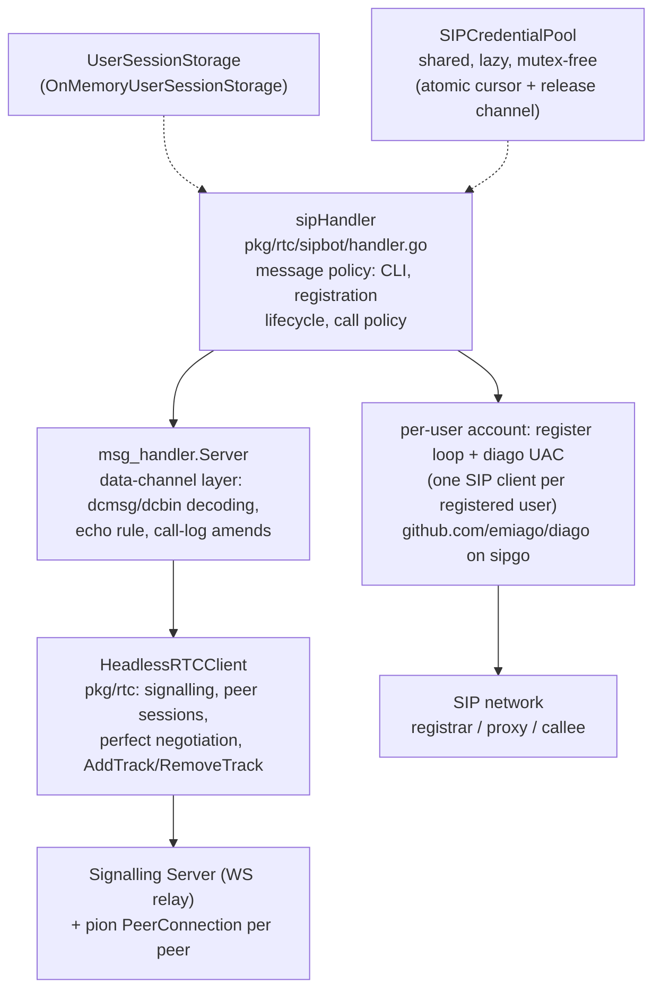

# SIP Bot — Design

Status: **design** (pre-implementation). The doc is the plan of record for
`pkg/rtc/sipbot`; deviations discovered during implementation are to be
folded back into it.

## 1. Purpose

The sip bot is a **session border controller (SBC)** between two voice
networks that share nothing but this host:

- the site's **WebRTC voice network** — the chat subsystem's phone
  sessions, where a call is an in-band SIP-subset dialog over the pair's
  `dcmsg` data channel plus an audio m-line on the pair's long-lived P2P
  peer connection (see `docs/signalling-server.md`, `docs/music-bot.md`);
- an external **SIP voice network** — any RFC 3261 registrar/Proxy the
  bot can reach over UDP (an Asterisk/FreeSWITCH/Kamailio, a residential
  VoIP provider, …).

In SIP terms the bot is a **B2BUA (back-to-back user agent)**: it
terminates both signalling planes and both media planes and relays each
into the other. Toward the SIP network it is a UAC (REGISTER + INVITE)
and a UAS (inbound INVITEs to a registered AOR); toward the browser it
is a headless bot peer (the third policy bot on the three-layer bot
stack). The user in the browser can thus phone an arbitrary SIP
subscriber — and a SIP subscriber who dials the user's registered AOR
rings the user's browser (§7.2):

```
browser ──(WebRTC: SRTP, opus)──▶ SIP BOT ──(SIP/RTP: negotiated)──▶ PBX ──▶ callee
       ◀──                        ◀──(SIP INVITE to a registered AOR)──── caller
dcmsg SIP-subset dialog            real SIP: REGISTER, INVITE (both
+ renegotiated m-line              directions), BYE; plain RTP media
```

Like the music bot and the echo bot, the bot is hosted by the server
binary as an ordinary authenticated signalling client
(`cmd/server/main.go`'s `startBotClient`), and like the music bot its
chat is a telegram-style CLI.

## 2. Position in the stack



- **webrtc-leg**: layers 1–3, identical to the music bot's. The audio
  codec toward the browser is **opus** (48 kHz), carried on a
  `TrackLocalStaticSample` attached to the pair's existing peer
  connection; the in-band dialog verbs (`INVITE`/`200 OK`/`CANCEL`/`BYE`)
  ride `dcmsg`. No new connection is ever created — "a call" is the pair's
  connection gaining an m-line, plus a SIP dialog on the other leg.
- **sip-leg**: one `diago.Diago` transaction user **per registered chat
  user** — each `/register` opens a dedicated SIP client (its own sipgo
  UA, named for the user's SIP username, and its own UDP socket) that
  lives as long as the account. The registration (a `diago.Register`
  loop) and every outbound call (a `diago.Invite` →
  `DialogClientSession`) run on the account's own client, so the wire
  identity is that user's alone: the `From` is the AOR, the `Contact`'s
  `From` is the AOR, the `Contact`'s
  user part is the username, the digest credential is the user's — the
  bot's own identity never appears, and no user's credential ever rides
  another user's transport. The same client is the UAS for inbound
  calls: an INVITE arriving on the account's socket is routed to the
  account's owner and rings their browser (§7.2). The codec toward the
  SIP network is **whatever the SDP negotiation settles on**; the bot
  offers, in preference order, **opus, PCMU, PCMA** (plus
  telephone-event, which the media relay ignores — see §11), in both
  directions.

The two legs meet only inside the bot: signalling state is relayed by the
handler (§7), media by a per-call **relay** (§8).

## 3. The CLI

Chat lines, exactly like the music bot's commands:

| Command                              | Effect                                                                                                                                                                                                                                                                                                                                                                             |
| ------------------------------------ | ---------------------------------------------------------------------------------------------------------------------------------------------------------------------------------------------------------------------------------------------------------------------------------------------------------------------------------------------------------------------------------- |
| `/help`                              | print the help text — what the bot is and does, then the command list                                                                                                                                                                                                                                                                                                              |
| `/register <user@host> <password>`   | associate the chat user with the SIP credential, REGISTER the AOR `sip:user@host` against its host, and keep the registration alive (§6). A later `/register` re-registers (replaces the credential).                                                                                                                                                                              |
| `/unregister`                        | cancel the registration (a SIP de-REGISTER goes out), drop the stored credential, and end any call in progress                                                                                                                                                                                                                                                                     |
| `/my-number`                         | print the user's currently registered SIP address — the number others can dial to ring this chat (§7.2) — or answer that the user is not registered to a SIP registrar yet. Reads the LIVE registration: a stored credential whose registration died (or has not run yet) is not callable and reads as not-registered. A number loaned from the credential pool is marked as such. |
| `/call <user@host>` (or bare `user`) | phone the callee through the SIP network and the user through the browser; one active call per chat user. A bare `user` is completed with the registered account's domain. Without a registration the bot loans an account from the credential pool when one is configured and has one free (§5), and says so; when the pool is empty (or absent), the answer points at /register. |
| `/yellow-page`                       | print the yellow page — the phone book of example callable numbers from the configuration (the <sipBot/> element's <yellowPage/> child, §10), grouped by section: who to call, without memorizing numbers                                                                                                                                                                          |
| `/test-call`                         | phone the configured test callee (the `<sipBot/>` element's `testSIPContact`, e.g. `9664@192.168.1.2`) — a known-good subscriber of the SIP network the deployment tests against; answers unavailable when unconfigured                                                                                                                                                            |
| `/hangup`                            | end the current call from chat (equivalent to the browser's hangup button)                                                                                                                                                                                                                                                                                                         |

Every command answers with a chat reply (`Reply`), threaded on the
command. Unknown commands and attachments are answered like the music
bot's (`Unrecognized command — try /help.`, an attachment refusal).
Incoming **browser** calls (a chat user phoning the bot directly, voice
and video alike) are declined with 603: a browser-originated call to
the bot has no routing target (see §11). The reverse direction — a SIP
subscriber phoning the user's registered AOR — is accepted and rings
the browser (§7.2).

Prompt-deficiency note: the request's "`/registered` command" is read as
the `/register` command defined alongside it; there is no separate
`/registered` command.

## 4. Session storage

The bot constructor takes an external, in-memory user session storage —
a small service-like key/value interface. It exists so the credential
store is the caller's affair (the shipped wiring uses the on-memory
implementation; a persistent or shared implementation can be injected
without touching the bot).

```go
// UserSession is one chat user's SIP identity as the bot keeps it:
// the credential /register captured, or a loan from the credential
// pool (§5). It is deliberately plain data —
// the registration's runtime (its cancel func, its diago handles) is
// the handler's, not the store's, so an implementation can serialize
// sessions freely.
type UserSession struct {
    // AddressOfRecord is the SIP AOR as given: "2001@sip.example.com".
    AddressOfRecord string
    // Username is the digest-auth username (the AOR's user part).
    Username string
    // Host is the registrar (the AOR's host part, without a port);
    // Port is its port, zero for the default. (sip.Uri keeps the two
    // separate; stuffing "host:port" into one string mis-builds URIs.)
    Host     string
    Port     int
    Password string
    // Pooled is true when the credential is a loan from the bot's
    // credential pool: the loan returns to the pool when the session
    // leaves the store (/unregister, a replacing /register, the peer
    // session's end).
    Pooled bool
}

// UserSessionStorage is the bot's user-session store: a key/value
// service keyed by the chat subscriber id. Implementations must be
// safe for concurrent use.
type UserSessionStorage interface {
    // Load returns the session stored for user, ok=false when none is.
    Load(user ss.SubscriberId) (UserSession, bool)
    // Store associates user with session, replacing any previous one.
    Store(user ss.SubscriberId, session UserSession)
    // Delete drops user's session; ok is false when none was stored.
    Delete(user ss.SubscriberId) (session UserSession, ok bool)
}

// OnMemoryUserSessionStorage is the shipped implementation: a plain
// map under a RWMutex, living and dying with the process.
type OnMemoryUserSessionStorage struct { /* mu + map */ }

func NewOnMemoryUserSessionStorage() *OnMemoryUserSessionStorage
```

Constructor (mirroring `musicbot.New`'s shape, with the store as its own
parameter per the requirement):

```go
func New(client *rtc.HeadlessRTCClient, storage UserSessionStorage, pool *SIPCredentialPool, config Configuration)
```

`Configuration` carries the logger and the SIP-side knobs (§10); the
pool is §5's credential pool, shared by every chat user (nil: no pool —
the allocate path then always fails into the `/register` hint).

## 5. The credential pool

`/register` is the user bringing their own SIP account. A deployment
can also **lend** its own: the `<sipBot/>` element carries an optional
`<sipCredentialPool/>`, the bot's pool of SIP accounts for chat users
who bring none — zero or more `<sipCredential/>` entries, then zero or
more `<sipCredentialRange/>` entries:

```xml
<sipCredentialPool>
  <sipCredential sipUri="sip:1001@sip.example.com" password="1234" />
  <sipCredentialRange usernameRange="1101-1120" password="hell0" sipServer="sip.example.com" />
</sipCredentialPool>
```

A `<sipCredential/>` is one account: the full SIP URI and its password.
A `<sipCredentialRange/>` is a span of accounts sharing one password
and one server: `usernameRange` is a range expression,
`<integer>-<integer>`, both ends inclusive (`"1101-1120"` is the twenty
accounts 1101…1120; the integer is the username, so leading zeros are
not preserved), and `sipServer` is the registrar as `host[:port]` (the
schema marks it optional so a range can be sketched without it; the
wiring rejects an empty one at startup, like any invalid entry). IPv6
literals are written bracketed, as in a SIP URI: `sipServer="[2a0a:4cc0::1]:5060"`
— the same form holds for a `<sipCredential/>`'s `sipUri`, the
`testSIPContact`, and the CLI's addresses.

The pool is **lazy**: a range is kept as its descriptor (from, to,
password, server) and a username is materialized into a `UserSession`
only when the allocation cursor passes its index — a 10 000-account
range costs two integers at startup, not 10 000 structs. (A span cap —
100 000 per range — keeps a typo'd endpoint from sizing the release
channel absurdly.)

The pool is **stateful** — it tracks which accounts are on loan — and
**shared**: one `*SIPCredentialPool` is injected into the bot
constructor and every chat user draws from it. It is concurrency-safe
**without a mutex**: the fresh-credential cursor is an `atomic.Uint64`
over the descriptor space (explicit entries first, then the ranges in
document order), and returned loans ride a buffered channel whose
capacity is the pool's size. The method set is the minimum a pool
needs:

```go
// Allocate loans a free credential; ok is false when the pool is
// empty or exhausted (a nil pool is a valid empty pool). Fresh
// credentials come first; released loans are re-used only once the
// fresh run out, so an account that just failed a registration sinks
// to the back of the queue instead of failing the very next user too.
Allocate() (UserSession, bool)
// Release returns a loaned credential. Releasing one that is not on
// loan hands it out twice — SIP tolerates concurrent registrations of
// one account, and the bot releases each loan exactly once by
// construction.
Release(credential UserSession)
```

The loaned value is a full `UserSession` with `Pooled: true`; it lives
in the store like a `/register`ed credential, the flag marking the loan
for the release points.

**When the bot allocates**: on demand, at the moment the user expresses
intent to phone — a `/call` (or `/test-call`) from a user with neither
a live registration nor a stored credential. Not at session start: the
bot holds a peer session with every online channel member, so
presence-based allocation would loan accounts to lurkers who never
dial. Call-time allocation loans only to users who actually phone, at
the price of that first `/call` bearing the bounded synchronous
REGISTER round trip `/register` already pays (§6) — and the user is
told what they got before the `Calling …` line: `Registered as
sip:1101@sip.example.com (an account from the bot's pool).`

Inside `/call`'s account resolution the order is: live registered
account → use it; stored credential → revive it; otherwise → `Allocate`
→ REGISTER the pooled account exactly like `/register` does → store it
(flagged) → dial. Both failure modes answer the user so they know to
fall back to `/register` (that is the requirement): no pool configured
→ the v1 `Not registered — /register … first.`; an exhausted pool →
`The bot's pool of SIP accounts is empty — /register … to use your own
account.`; a pooled account the registrar rejects → the loan returns to
the pool and the reply says which account failed and that `/register`
is the fallback.

**A loan is released** exactly when its session leaves the store:
`/unregister`; a replacing `/register` (the user's own credential
supersedes the loan); the peer session's end (the §9 lifecycle hook).
A loan is therefore session-scoped — unlike a manual credential, which
survives the session in the store by design (§4); a reconnecting user's
next `/call` allocates afresh, possibly a different account, which an
outbound-only SBC can shrug at.

**Duplication is the operator's business**: the pool neither detects
nor rejects duplicate entries (an explicit credential inside a range's
span, two overlapping ranges) — SIP allows concurrent registrations of
one account at the protocol level, and whoever authors the
configuration owns the consequence.

## 6. Registration lifecycle

`/register 2001@sip.example.com passW_0rd`:

1. **Validate**: `sip.ParseUri("sip:" + arg)` must yield user+host; the
   command's two fields map to `UserSession{AddressOfRecord, Username,
Host, Password}`.
2. **Store** the session, replacing any previous one (and cancelling the
   previous registration loop, after hanging up any call in progress).
3. **First REGISTER synchronously, with a timeout** (~5 s, ctx-scoped):
   `diago.RegisterTransaction(...).Register(ctx)` performs the
   digest-authenticated transaction — on the account's own client (§2),
   the request stamped with the user's identity: the `From` is the AOR
   (diago would default it to the socket's own address), the `Contact`'s
   user part is the username (the account UA's name), the digest
   credential is the user's. A registrar matching the identity against
   the credential sees one consistent user, never the bot. The handler
   replies from the actual outcome — `Registered as
sip:2001@sip.example.com.` or the failure (`Registration failed: 401
Unauthorized`) — because a bot has no unsolicited-send path outside a
   handler invocation (the ResponseWriter is per-message), and a wrong
   password must be told to the user, not just logged. The bounded
   network round trip on the channel goroutine is the same trade the
   music bot's lazy song opens already make. The one spurious failure
   this step absorbs silently is diago's startup race (caveat 18): the
   first transaction's bind conflict is retried, never reported.
4. **Re-registration in the background**: the same goroutine then loops
   re-REGISTERing before expiry (diago's qualify loop semantics;
   `Expiry` default 300 s, `RetryInterval` on transient failures). Its
   ctx is cancelled by `/unregister`, a replacing `/register`, the
   peer-session end, or process shutdown.
5. `/call` requires a session whose registration is believed live; a
   registration that died in the background surfaces at the next command
   (`Not registered — /register first.`). A `/call` from a user with no
   credential at all tries the credential pool first (§5); only when the
   pool cannot provide an account, or the pooled account fails to
   register, does the command answer with the `/register` hint.

## 7. Call flows

### Outbound — `/call 1001@sip.example.com`

The bot opens **both** legs and relays each leg's events into the other.
The SIP INVITE can take seconds (ringing), so it runs on its own
goroutine — the dcmsg goroutine never waits on the PSTN.

```mermaid
sequenceDiagram
    participant U as User (browser)
    participant H as sipHandler
    participant R as relay (media)
    participant P as SIP network (diago UAC)

    U->>H: "/call 1001@sip.example.com"
    Note over H: session must be registered;<br/>one call per user
    H->>H: call state + opus track created<br/>w.OnTrack(mic handler)
    H->>U: w.Invite(voice) — the browser rings
    H->>U: "Calling 1001@sip.example.com…"
    H-->>P: diago.Invite(ctx, callee, creds) — async
    U->>H: 200 OK (user answered)
    H->>R: AttachMedia(track) → renegotiation<br/>→ SRTP to the browser
    Note over R: mic pump starts: opus RTP →<br/>sip-leg writer (§8)
    P-->>H: 183 Ringing (no early media in v1)
    P-->>H: 200 OK + SDP answer → codec known
    Note over R: callee pump starts: payload reader →<br/>opus → track.WriteSample<br/>(drops while the browser leg rings —<br/>the "empty room" pattern)
    H->>U: "Callee answered." (only when the<br/>SIP answer precedes the user's)
    U->>H: BYE (hangup button or /hangup)
    H->>P: dialog.Hangup(ctx) → SIP BYE
    H->>R: stop pumps, DetachMedia (delayed,<br/>music-bot hangup discipline)
```

The reverse-propagation cases:

- **Callee busy / unreachable**: the SIP INVITE fails (4xx/408/no
  answer). If the browser leg still rings → `w.Cancel(callId)` (§9); if
  the user already answered → `w.Bye(callId)`. Chat reply:
  `Call failed: 486 Busy Here.`
- **Callee hangs up**: the dialog's ctx ends → the relay stops → the
  browser leg gets `w.Bye(callId)`, the chat a `Callee hung up.` line.
- **User hangs up** (BYE/CANCEL on dcmsg, or `/hangup`): the SIP dialog
  gets `Hangup` (BYE after answer, CANCEL while it rings), the relay
  stops, the track detaches after the music bot's `hangupDetachDelay`
  (the browser is tearing down its side at the same instant; the
  withdrawal must not race its offer into a glare rebuild).
- **Peer session ends** (the browser drops): the session ctx cancels
  everything, and the framework's lifecycle hook (§9) runs the bot's
  session-end teardown — the call ends (the callee gets the BYE), the
  account stops (its de-REGISTER goes out), and a pooled loan returns
  to the pool with its store entry dropped (a manual credential
  survives in the store by design).

Mid-call `/call` (a second one) is refused while a call stands; `/play`-style
switching has no meaning here.

### Inbound — a SIP subscriber phones the user

The reverse direction: someone on the SIP network dials the AOR a user
registered (their own credential, or a loaned pool account while the
loan lasts), the registrar routes the INVITE to the account's socket,
and the bot rings the user's browser. The browser needs nothing new —
an inbound call is a bot-originated INVITE on the webrtc-leg, exactly
the verb `/call` already uses: the answer popup, the accept (whose mic
attach precedes the bot's media, §11.13), the decline, the hangup are
usePhoneCalls' generic incoming-call path.

```mermaid
sequenceDiagram
    participant P as SIP network (caller)
    participant H as sipHandler
    participant R as relay (media)
    participant U as User (browser)

    P->>H: INVITE on the account's socket (diago UAS)
    Note over H: one call per user, either direction:<br/>busy → 486 Busy Here; no live session →<br/>480 (the Invite fails)
    H->>P: 180 Ringing
    H->>U: w.Invite(voice) — the browser rings<br/>(Server.WriterFor — §9's unsolicited path)
    H->>U: "Incoming call from <caller>…"
    Note over H: ring timeout (60 s) arms: 480 to the caller,<br/>CANCEL to the browser
    U->>H: 200 OK (user clicked accept)
    H->>R: AttachMedia(track) → renegotiation
    H->>P: 200 OK + SDP answer (diago Answer, ACK-awaited)<br/>→ codec known → relay arms (§8)
    Note over R: both pumps run: caller's RTP → opus → track,<br/>mic → sip-leg writer
    P->>H: BYE (the caller hangs up)
    H->>U: w.Bye(callId) — the browser leg ends
```

The SIP side of an inbound call is diago's `DialogServerSession`, the
UAS counterpart of the outbound dial's client session. The mechanics
discovered in its (and sipgo's) source, on which the flow rests:

- **The serve handler owns the dialog's lifetime**: diago's OnInvite
  wrapper hangs up and closes the dialog the moment the serve callback
  returns, so the inbound handler blocks on the dialog's
  `Context().Done()` until the call is over, whichever side ended it.
- **The dialog's ctx is the one "the SIP side ended" signal**: sipgo's
  ReadInvite wires the INVITE transaction's OnCancel into the dialog —
  a caller's CANCEL of a still-ringing call ends the ctx — and BYE, the
  bot's own final response, and the SIP server's shutdown end it too.
  The inbound call arms its watcher on it at creation (outbound arms
  only after the answer: a client dialog's ctx does not exist before),
  and the end relayed to the browser is a CANCEL while it rings, a BYE
  once answered — the same `tellBrowserEnded` as outbound.
- **`Hangup` speaks the dialog's own state**: diago's server-side
  Hangup is a BYE on a confirmed dialog and a 480 Temporarily
  Unavailable on a still-ringing one — so every generic termination
  (the browser's CANCEL/BYE, /hangup, /unregister, a replacing
  /register, the session's end, the ring timeout) calls it without
  tracking whether the 200 OK has gone out. The one exception is the
  user's explicit decline (the browser's 603), mirrored to the caller
  as a 603 Decline.
- **`Answer` is the 200 OK**: it builds the media session from the
  account's codec list (the same opus-first preference the outbound
  offers), sends the SDP answer, and blocks until the caller's ACK (64·T1
  bound) — so it runs on its own goroutine when the browser's 200 OK
  arrives, and its success binds the relay through the outbound path's
  exact-once discipline (a call that ended while Answer blocked gets
  its just-answered dialog BYEd by the answerer itself).
- The relay and the codec matrix are direction-blind (§8): the dialog's
  payload reader/writer is the DialogMedia both session types embed.

Inbound calls are to a **registered** identity: the INVITE arrives on
the account's socket, so the account exists by construction. A pooled
loan rings its borrower while the loan lasts; once the session ends,
the loan and its socket are gone (§5). The registrar's own screening
aside, the bot does not digest-authenticate inbound INVITEs (diago has
no UAS auth) — §11 owns that tradeoff.

## 8. The media plane: relay + codec matrix

Each established call owns a **relay**: the webrtc-leg opus track
(bot→browser), the browser's mic `TrackRemote` (browser→bot), and the
sip-leg dialog's payload reader/writer. Two pump goroutines, one per
direction, each a read→(maybe transcode)→write loop. diago's
`DialogMedia.AudioReader`/`AudioWriter` read and write **encoded
payload** at packet granularity — exactly the relay's currency, so no
RTP header work reaches the bot.

| sip-leg codec (negotiated) | webrtc-leg codec (fixed) | SIP → browser                                | browser → SIP                                                 |
| -------------------------- | ------------------------ | -------------------------------------------- | ------------------------------------------------------------- |
| opus                       | opus                     | **passthrough**: payload → WriteSample       | **passthrough**: payload → AudioWriter                        |
| PCMU (G.711 μ-law)         | opus                     | μ-law decode → 8k→48k resample → opus encode | opus decode → stereo downmix → 48k→8k resample → μ-law encode |
| PCMA (G.711 A-law)         | opus                     | A-law decode → 8k→48k resample → opus encode | opus decode → stereo downmix → 48k→8k resample → A-law encode |

Transcoding is **avoided whenever both legs are opus** — the codec's own
packets cross the SBC byte for byte; the code makes the passthrough the
first branch, not a degenerate case of a transcode pipeline.

Transcoding specifics:

- **G.711** via `github.com/emiago/diago/audio`'s slice helpers (on
  `github.com/zaf/g711`) — 160 samples per 20 ms frame, pure Go.
- **Opus decode/encode** via `github.com/hraban/opus` (libopus, cgo) —
  the same binding the music bot encodes with, behind the same `cgo`
  build-tag discipline with a stub for pure-Go builds. Voice frames are
  encoded **mono** 48 kHz at telephony bitrate; a mono packet on the
  stereo-negotiated webrtc leg is valid RFC 7587 and plays as dual mono.
- **Resampling** 8 kHz ↔ 48 kHz is factor-6: 6:1 box-average decimation
  down, 1:6 linear interpolation up — telephony-grade, allocation-free
  per frame. (Not a polyphase filter; §11 owns that tradeoff.)
- **Packet-duration freedom**: opus packet durations come from the TOC
  byte (RFC 6716 §3.1 — frame count × per-frame duration), so the
  webrtc-bound direction timestamps exactly. Transcoding pumps run a
  small **sample accumulator**: input packets of any ptime are decoded
  into it, and whole 20 ms output frames (160 @ 8 kHz / 960 @ 48 kHz)
  are emitted as they fill — diago's RTP writer clocks one codec ptime
  per write, and pion's track one `Duration` per sample.
- **Pacing**: SIP→browser is self-paced by the arriving RTP; the
  accumulator never writes ahead of the network. browser→SIP is paced by
  the browser's mic packets. No tickers anywhere — unlike the music bot
  there is no free-running source.
- **Timing tolerance**: read loops treat a read error as end-of-call
  media (the leg is gone) and stop the call; write errors on an unbound
  webrtc track are the music bot's benign "empty room".

**cgo gating**: a pure-Go build plays opus↔opus calls (passthrough needs
no codec) and refuses a call whose sip-leg negotiated G.711, with the
explanatory error — the music bot's stub discipline, extended to a
decoder.

## 9. Framework extensions: bot-originated `Cancel`/`Bye`, the unsolicited-send path, and session lifecycle hooks

An SBC terminates signalling: when the **callee** ends or refuses the
call, the **browser's** dialog must end too. Today the
`msg_handler.ResponseWriter` can originate an INVITE (`Invite`) and
answer one (`Accept`/`Reject`), but not terminate the bot's own dialog —
the music bot never hangs up first. The extension is small and in the
framework's own idiom:

```go
// ResponseWriter, two new methods:
// Cancel aborts the bot's own still-ringing outgoing call (the
// dialog's CANCEL); callId is the id Invite returned.
Cancel(callId string) error
// Bye ends the bot's own established outgoing call (the dialog's BYE).
Bye(callId string) error
```

Each sends the corresponding `application/x-sip` DCMsg and posts the
Server's existing `sipDialogNote` (`callStatusCancelled` /
`callStatusEnded`), so the hub's `foldDialog` amends the INVITE's logged
status exactly as it does for inbound dialog messages — the caller-side
log duty stays the Server's, never the handler's. No handler-visible
state changes; the echo bot and the music bot are untouched (the
interface grows, no signature changes).

### The unsolicited-send path: `Server.WriterFor`

An inbound SIP call arrives on the account's socket goroutine — not
inside a handler invocation — but the ResponseWriter is per-message:
the bot had no way to ring a browser that said nothing. The Server
gains the spontaneous counterpart:

```go
// WriterFor returns a ResponseWriter bound to the peer's current
// session — the unsolicited-send path, for answering an event that is
// not one of the peer's messages. The writer threads on no message and
// is bound to no call; a peer with no live session yields a writer
// whose sends all fail with ErrNoMessagingChannel.
func (s *Server) WriterFor(peer ss.SubscriberId) ResponseWriter
```

The implementation is the hub's existing per-report lookup: the peer
record (and its up-note) gains the session's channel id, the
messaging-channel query's reply carries it, and WriterFor builds the
writer on whatever the registry currently holds — a glare rebuild's
channel swap is invisible to it, exactly as for the binary side's chunk
queries. The writer is otherwise the ordinary one: `Invite` posts the
same `inviteSentNote`, so the caller-side status amends of an inbound
SIP call's webrtc-leg are the Server's own conditioning, unchanged.

The sip bot keeps the Server in a handler field set by `New` right
after `NewServer` returns — a wiring-time assignment: no handler
invocation can precede the client's Run, which the caller starts after
`New`. The field is an interface (`WriterFor(peer)`), so tests can
substitute it.

### The session lifecycle hooks

A pool loan ends when the chat session ends (§5) — but the
`BotMessageHandler` interface had no way to say so: the session's ctx
is canceled, and a bot that cared armed its own watcher goroutine (the
sip bot did it twice over, per call and per account). The framework now
says it itself:

```go
// HandlePeerSessionStart handles the start of the peer's session at
// this layer: the pair's messaging channel came up for a peer with no
// live session.
HandlePeerSessionStart(ctx context.Context, peer ss.SubscriberId)
// HandlePeerSessionEnd handles the genuine end of the peer's session.
HandlePeerSessionEnd(ctx context.Context, peer ss.SubscriberId)
```

The Server's hub goroutine is the only place that can tell a genuine
transition from a **glare rebuild**: its peer registry keys the record
by peer, so a rebuild's re-registration just replaces a live record,
and a stale invocation's down-note is recognized by the channel's
identity — neither fires a hook. The hub invokes the hooks
synchronously on the genuine transitions, and the discipline follows
from the venue: the hooks are **bookkeeping, not messaging** — they get
no ResponseWriter (a start has no message to answer; at an end the peer
is gone), and they must be fast, because they run on the hub every
peer's bookkeeping crosses. The end hook's ctx is the session's,
already canceled: it carries the session's values, not a cancellable
lifetime. (A reconnect that outruns the old session's down-note reads
as a rebuild — no hooks fire, and the credential in the store simply
persists, which is exactly the pre-hook behavior.)

The interface grows; the echo bot and the music bot implement the hooks
as no-ops. The sip bot puts its whole session-end teardown in the end
hook — replacing the two ctx-watcher goroutines of the pre-hook design:
end the call in progress (the callee's dialog gets its BYE; the browser
leg is gone, there is nothing to tell), stop the account (its own ctx
teardown sends the de-REGISTER), and return a pooled loan — the store
entry is dropped, the credential released. The start hook is a
deliberate no-op: allocation is on-demand (§5), because the bot
sessions with every online channel member and presence alone must not
drain the pool.

## 10. Hosting and configuration

- `serverConfig.xsd` / `serverconfig.go`: a `<sipBot/>` element of the
  existing `botClientType` (url, jwt, channelId, subscriberId,
  iceServers, the timing knobs) — identical identity mechanics to the
  echo/music bots (a static session JWT from the `sign` subcommand,
  `--sub bot:sip --username "SIP Bot"`).
- `cmd/server/main.go`: `startSipBot` on the shared `startBotClient`,
  wiring `sipbot.New(client, sipbot.NewOnMemoryUserSessionStorage(),
pool, cfg)` and reusing `stereoOpusPCFactory` (the webrtc leg negotiates
  opus either way; PCMU/PCMA stay registered for the browser's own
  calls).
- The `<sipBot/>` element carries its own attributes beyond
  `botClientType`: `testSIPContact`, the SIP address the CLI's
  `/test-call` command dials (e.g. `9664@192.168.1.2`) — a known-good
  callee for deployment smoke tests; empty disables the command —
  `ipPreference`, the address family every DNS resolution in the sip
  leg honors: `v6Only`, `v4Only`, or `default` (the default); and
  `upstreamDNSResolver`, the upstream DNS resolver (host[:port], the
  port defaulting to 53) the family-filtering DNS proxy relays to —
  required with a non-default `ipPreference`, rejected with the
  default. Under a non-default preference the registrar's and callees'
  hostnames resolve only to the chosen family's records (A for
  `v4Only`, AAAA for `v6Only`), so registrations, calls, and the
  account sockets' bind-address selection all take the same family, and
  a hostname with no record of the chosen family fails its registration
  with the DNS error. IP literals are not resolutions and pass
  unaffected — a wrong-family literal registrar simply fails to send.
  `default` keeps sipgo's own behavior (IPv4 preferred, IPv6 used when
  no A record exists). Mirrored by `SipBotXML.IPPreference` /
  `SipBotXML.UpstreamDNSResolver`, validated at startup
  (`ParseIPPreference` — the pool's discipline), carried by
  `Configuration.IPPreference` / `Configuration.UpstreamDNSResolver`.
- `sipbot.Configuration`: `Logger`, `TestSIPContact`, `IPPreference`,
  `UpstreamDNSResolver`, and the sip-leg
  knobs — `Transport` (default `udp`), `ExternalHost` (default empty; the
  SDP/RTP address the PBX sees, for hosts where the bind address is
  wrong), `RegisterExpiry` (default 300 s). Each registered account
  binds its own diago transport — a dedicated socket per user — so keep
  `BindPort` at 0: a fixed port admits one account at a time. An empty
  `BindHost` (the default) binds each account to the source address of
  the route to its registrar — the Contact and SDP advertise the address
  the registrar already sees, in the registrar's own address family
  (constrained by `ipPreference` when one is set: the route lookup
  resolves the registrar through the same filtering proxy), so IPv6
  registrars work (an IPv4 socket cannot write to one); an explicit
  `BindHost` is used verbatim for every account, its family constraining
  which registrars are reachable. Either way an account's family is its
  registrar's: a `/call` to a literal address of the other family (a v6
  literal from a v4-registrar account) cannot cross — dial those through
  the registrar.
- The `<sipBot/>` element's optional `<sipCredentialPool/>` child is
  the credential pool (§5): `<sipCredential/>` entries and
  `<sipCredentialRange/>` spans, mirrored in `serverconfig.go` by
  `SipCredentialPoolXML` / `SipCredentialXML` /
  `SipCredentialRangeXML` and converted at wiring time —
  `NewSIPCredentialPool` rejects an invalid entry (a malformed
  `sipUri`; a `usernameRange` that is not `<integer>-<integer>`, is
  reversed, or spans more than 100 000 accounts; an empty or
  unparseable `sipServer`) and fails the startup, the music bot's
  audioSource discipline. The `usernameRange` attribute additionally
  carries an XSD pattern (`[0-9]+-[0-9]+`) so a malformed value is
  flagged by the schema alone; the semantic checks stay Go-side.
- The `<sipBot/>` element's optional `<yellowPage/>` child is the bot's
  phone book — the deployment's example callable numbers, printed into
  the chat by the CLI's `/yellow-page` command so a user can pick a
  callee without memorizing numbers: zero or more `<section/>` elements
  (`id` an opaque string, `name` the display caption the listing
  prints), each holding zero or more `<contact/>` entries (`id`, `name`,
  an optional `description`, and the `aor` — the dial target, anything
  `/call` accepts: a bare user (`9196`), user@host, or a full SIP URI).
  Mirrored in `serverconfig.go` by `YellowPageXML` /
  `YellowPageSectionXML` / `YellowPageContactXML` and converted at
  wiring time into `Configuration.YellowPage`. No entry is validated —
  deliberately, the `aor` above all: a bad one simply fails when someone
  `/call`s it, with `/call`'s own error for an answer.

## 11. Concerns and caveats

Owned decisions and known limits of v1 — several are prompt-silent areas
where a choice had to be made:

1. **The password crosses the chat.** `/register … passW_0rd` is a chat
   message: it sits in both ends' histories, is echoed by the Server
   like any line, and could be logged by relays. v1 accepts this (it is
   the requested UX); a future version could delete/redact the command
   message via chat control, or take credentials over a side channel.
2. **Credentials and registrations are volatile**: the on-memory store
   dies with the process; every chat user re-registers after a bot
   restart. (A persistent `UserSessionStorage` + re-registration on
   first use is the designed-for follow-up — the store holds plain data
   precisely so this is possible.) Pool loans are narrower still:
   session-scoped (§5), so a reconnect re-allocates and the caller
   identity may change between sessions — harmless for an outbound-only
   SBC.
3. **Inbound SIP calls are not authenticated.** The UAS side answers
   any INVITE that reaches a registered account's socket (diago's serve
   handler has no digest auth) — the registrar's own screening and the
   socket's ephemeral port are the only gatekeepers, so a direct-to-
   socket INVITE bypasses whatever the SIP network would have filtered.
   One call per user gates the SIP side too: a second inbound call
   while one stands gets 486 Busy Here. Inbound **browser** calls (a
   chat user phoning the bot directly) are still declined with 603 —
   they have no routing target (§3).
4. **One call per chat user** at a time; no hold, transfer, conferencing,
   or blind/attended REFER. The SIP `REFER`/`re-INVITE` surfaces diago
   offers are left unwired.
5. **No early media / ringback in v1**: between the browser's answer and
   the callee's answer the user hears silence. diago's
   `EarlyMediaDetect` + `WaitAnswer` can carry 183 ringback later — the
   relay's "empty room" discipline already tolerates media before the
   browser answers, so the follow-up is local to the dial path.
6. **No DTMF**: telephone-event is negotiated (PBXs offer it) but the
   relay drops it; IVR menus are unreachable in v1. diago's
   `DTMFReader`/`DTMFWriter` are the follow-up hooks.
7. **ptime assumption on the sip-leg writer**: writes are whole 20 ms
   frames (the accumulator guarantees them), matching diago's clock;
   the SDP advertises no exotic ptime. Opus passthrough timestamps come
   from the packets' own TOCs, so a non-20 ms opus peer still lands
   correctly on the webrtc leg.
8. **Resampler quality** is telephony-grade (box/linear, factor 6), not
   broadcast-grade; voice over G.711 loses to the codec long before the
   resampler. A proper polyphase filter is a drop-in replacement behind
   the same functions.
9. **NAT**: the sip leg is plain UDP SIP + plain RTP (no ICE, no STUN,
   no SRTP/SDES in v1). The bot belongs on a network that reaches the
   PBX directly; `ExternalHost` covers the simple
   wrong-source-address case. Symmetric RTP latches onto the first
   received packet only insofar as the PBX does it — the bot sends from
   its negotiated port from the start.
10. **REGISTER round trip on the dcmsg goroutine** (§6): bounded by a
    5 s timeout; a dead registrar stalls that peer's command channel for
    at most the timeout, never the process.
11. **Security surface**: the SIP credential lives in process memory as
    plain data (digest auth needs the password, not a hash). The bot
    trusts the SIP network it is pointed at — a malicious PBX speaks to
    diago's parser, not to hand-rolled SIP code (the reason the
    wheelchair was not re-implemented).
12. **Glare on the webrtc leg** is inherited unchanged: the hangup
    track-detach delay and the polite-rebuild caveats of
    `docs/music-bot.md` §8 apply to the relay's track exactly as to the
    player's.
13. **The mic must arrive on a fresh m-line** (the browser's natural
    order — accept attaches the mic, then the bot's media follows):
    pion recycles a sendrecv transceiver for a later `AddTrack`, and a
    track that arrives on a recycled m-line re-binds its inbound RTP to
    the already-bound receiver **without firing `OnTrack`** (the
    session-29 trap) — the bot's `OnTrack` registration would never see
    the mic. The framework's register-before-INVITE discipline plus the
    browser's accept order keep this from happening; the bot also
    drains any unexpected non-opus track defensively.
14. **Pool passwords live in the configuration document** in plaintext
    (digest auth needs the password itself, never a hash) — the
    document's file permissions are the protection, exactly as for its
    OAuth client secrets; the in-memory caveat (11) covers the rest.
15. **Session-end cleanup races a dying session's in-flight command**:
    a `/call` whose bounded REGISTER outlives its session can re-store
    a pooled session after the end hook cleaned up — the loan then
    holds until the process restarts (and the account may register
    concurrently with a re-loaned twin, which SIP tolerates — §5's
    duplication note). Narrow, self-limiting, and not worth a lock.
16. **The inbound ring timeout is the bot's own** (60 s): a browser
    left ringing (the user walked away) is CANCELLed and the caller
    gets a 480; the timeout loses a same-instant-answer race
    deliberately (the end is gated on the call still ringing). A
    caller's CANCEL is NOT what bounds the ring — sipgo wires it into
    the dialog's ctx, so it is relayed to the browser the moment it
    arrives.
17. **An inbound answer's ACK is awaited out of band**: diago's UAS
    `Answer` blocks until the caller's ACK (64·T1 bound), so it runs on
    its own goroutine; a hangup landing inside that window terminates
    an early (unconfirmed) dialog with a BYE — not RFC-orthodox (a UAS
    should CANCEL an early dialog it answered... it cannot; only the
    UAC can), but sipgo sends it and every tested stack tolerates it.
    The window is the ACK's round trip, not the ring.
18. **diago's startup race**: `ServeBackground` reports the transport
    ready — and re-pins the client's connection address to the
    listener's just-bound port — a few instructions BEFORE sipgo pools
    the listener connection, so the account's first REGISTER can still
    miss the pool lookup and try to bind the account's own port
    (`EADDRINUSE`). `newAccount` retries exactly that error a handful
    of times inside the 5 s REGISTER budget (the listener is pooled
    almost immediately); any other failure is the registrar's real
    answer. The race is every account's first-transaction-only, so the
    keepalive and the dial paths never see it.
19. **The family-filtering resolver** (`ipPreference` ≠ `default`):
    sipgo's transport layer resolves every outbound request-URI host
    through its UA's `*net.Resolver`, replaceable via
    `WithUserAgentDNSResolver` — the library's only exported DNS hook
    (its own family-preference knob, `withTransportLayerDNSLookupIP`,
    is unexported as of v1.6.0, the latest release). The bot installs
    the pure-Go resolver (`PreferGo`) dialed at the bot's ONE filtering
    DNS proxy (shared by every account — the filter is stateless): a
    reverse proxy (miekg/dns) bound to an ephemeral loopback port, UDP
    and TCP alike (a truncated UDP answer's TCP retry must find a
    listener), relaying every query to the configured
    `upstreamDNSResolver` with `ExchangeContext` — except the
    suppressed family's qtype (AAAA under `v4Only`, A under `v6Only`),
    which it answers itself with an empty NOERROR (NODATA — never
    NXDOMAIN, which could poison the allowed family's parallel lookup;
    and with the RA bit set: an empty NOERROR that is neither
    authoritative nor recursion-available trips the Go resolver's
    lame-referral check). Everything else crosses untouched, so TTLs,
    CNAME chains, and NXDOMAINs keep their real meaning and sipgo's
    SRV fallback keeps working (the SRV target's chase re-enters the
    filter as ordinary A/AAAA queries). `bindHostFor` resolves through
    the same proxy, so the account socket's family always matches the
    wire's. The SIP messages on the wire are untouched — the hostnames
    stay hostnames; only the routing changes. The rest of the process
    keeps the system resolver: only the sip leg's accounts use the
    upstream.
20. **The resolver's edges**: names answered from a static source
    (`/etc/hosts`) never reach the proxy — the pure-Go resolver
    consults files first — so a dual-family hosts entry escapes the
    filter and sipgo's own prefer-IPv4 then applies (bindHostFor
    re-filters its own answers, so the socket's family still stays the
    preference's); IP literals short-circuit the same way
    (deliberately: a literal is not a resolution — a wrong-family
    literal registrar fails at send). The proxy is the bot's one
    addition to the process's socket table (a loopback UDP+TCP pair on
    an ephemeral port) and lives for the bot's lifetime — the process,
    in the shipped wiring.

## 12. Package layout and testing

`pkg/rtc/sipbot/`:

| file                         | contents                                                                                                                                                                      |
| ---------------------------- | ----------------------------------------------------------------------------------------------------------------------------------------------------------------------------- |
| `sipbot.go`                  | package doc, `Configuration`, `New` (wires the msg_handler.Server), `sipStack` (the per-account SIP client factory)                                                           |
| `session.go`                 | `UserSession`, `UserSessionStorage`, `OnMemoryUserSessionStorage`                                                                                                             |
| `pool.go`                    | `SIPCredentialPool` (+ the `SIPCredential`/`SIPCredentialRange` config shapes): the lazy, mutex-free account pool — the atomic cursor, the release channel, the range parsing |
| `yellowpage.go`              | the yellow page: the YellowPageSection/YellowPageContact config shapes and the /yellow-page listing's rendering                                                               |
| `dns.go`                     | the `ipPreference` machinery: the IPPreference type and its parse, and the filtering DNS reverse proxy (miekg/dns) the account UAs' resolver dials                            |
| `handler.go`                 | `sipHandler` — the `BotMessageHandler`: CLI dispatch (/my-number reads the live registration), registration lifecycle, call policy, hangup matrix                             |
| `inbound.go`                 | the inbound call: the account socket's INVITE → the browser's ring → the 200 OK relay-arming; the ring timeout, the dialog watcher, the UAS-side termination verbs            |
| `account.go`                 | per-user SIP account runtime: the register loop, the diago `Invite` dial path, and the inbound-INVITE routing callback the client is opened with                              |
| `call.go`                    | per-call state + the relay: the two pump goroutines, the `sipLeg` interface over both dialog types, track/dialog wiring, teardown                                             |
| `transcode.go`               | the codec matrix: passthrough, G.711↔PCM↔opus paths, resamplers, the sample accumulator, opus TOC durations                                                                   |
| `opus_codec.go` / `_stub.go` | libopus encode+decode behind the `cgo` tag; the pure-Go stub fails G.711-leg calls with the explanatory error                                                                 |

Tests mirror the existing suites' disciplines: `OnMemoryUserSessionStorage`
concurrency; the transcoder round trips (G.711 encode/decode against
`zaf/g711`, resampler factor invariants, accumulator ptime freedom, TOC
durations against RFC 6716's table); the handler's CLI against the
echobot/musicbot-style in-memory harness with a **fake SIP server**
(a `sipgo` UAS script: expect REGISTER, answer INVITE with a fixed SDP,
stream captured/generated RTP) so the B2BUA runs end to end in-process
— browser-side probe speaking dcmsg like `musicbot_test.go`, no real
network. The `/call` flow asserts both legs: the webrtc-leg dialog verbs
and track attach on one side, the SIP REGISTER/INVITE/BYE transactions
and relayed RTP on the other. The pool adds its own: unit tests for the
range parsing, the allocation order, exhaustion, and release/re-loan
(concurrency under `-race`); integration tests for the auto-allocated
`/call` (the REGISTER and INVITE carry the pooled identity), the
exhaustion and registration-failure replies, and the release points —
`/unregister`, a replacing `/register`, and the peer session's end (via
the harness's subscriber aging). The yellow page adds its rendering's
unit tests (sections, descriptions, the empty page) and a CLI
integration test: `/yellow-page` answers with the configured sections
and contacts, threaded on the command. `/my-number` adds its three
answers (not registered / registered / a pooled loan). Inbound calling
adds a UAC side to the fake PBX (a sipgo `DialogUA` INVITE to the
contact the registrar recorded, `WaitAnswer`'s ctx-cancel as the
caller's CANCEL) and its integration tests: end to end (the browser
rings, the 180 and the 200 + SDP cross, media flows both ways, the
caller's BYE ends the browser leg), the browser's decline crossing as
603, the caller's CANCEL crossing as the browser's CANCEL, and the
busy-at-the-browser inbound call's 486. The `ipPreference` machinery
adds its own: the parse's table (the values and the upstream pairing),
the filtering proxy driven through the REAL `net.Resolver` machinery
against a fake upstream resolver (a table-driven miekg/dns server: the
family filtering both ways, the NODATA of a name without the allowed
family's records, the upstream's NXDOMAIN propagating, the SRV relay,
the truncated answer's TCP retry, the IP-literal bypass),
`bindHostFor`'s family matrix, and an integration test with two fake
PBXs sharing one loopback port — one on 127.0.0.1, one on ::1 — where
the fake upstream maps the registrar's hostname to both families and
the REGISTER, the INVITE, and the de-REGISTER must arrive at the
preferred family's PBX alone. Two harness disciplines keep
the suite's flakes diagnosable and its teardown clean: a message wait
that times out dumps everything the probe recorded (a bot failure reply
the predicate did not expect is visible without a rerun), and the
fake's handler errors are dropped once teardown begins — a de-REGISTER
arriving mid-shutdown fails its response on a closing server, and a
t.Errorf from sipgo's goroutine after the test completed would panic.
